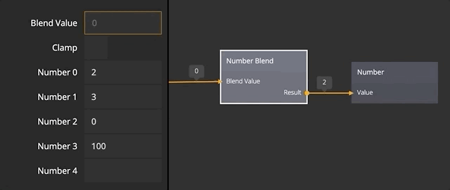

# Number Blend
Computes a result output based on blending (linearly interpolating) between the inputs.

## INPUTS
**Number 0..N**  
These inputs will be used to compute the result output port. When a value is specified new _Number_ input is created.
These ports are numbered as _Number 0_,_Number 1_ etc.

**Blend Value**  
The blend value specifies how the result output should be computed. The result is a linear interpolation of the input ports.
This means that if you specify _Blend Value_ as _0_ the result output will get the value of the _Number 0_ input, and a _Blend Value_ of _1_ will produce an output equal to _Number 1_. If a _Blend Value_ of _0.5_ is specified the output will be halfway between _Number 0_ and _Number 1_.

**Clamp**  
Controls the behavior when the _Blend Value_ is negative or higher than the highest _Number_ port index.

If Clamp is set to _No_ the interpolation can produce a result that is outside of the specified input numbers.
If _Clamp_ is set to _Yes_ then the result will get limited to the lowest or highest input number.

## OUTPUTS

**Result**  
The blended value computed from the inputs above.

