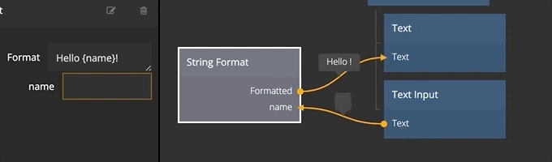

# String Format

Creates an output string from a string format specified and input ports.

## Inputs

**Format**  
This input contains the format string, that is the template that will be used to generated the output. Any part
of the template that is encapsulated in bracets will generate an input port. E.g. setting the string format to _{Hours} hours ago_
will create an input port called _Hours_.

## Outputs

**Formatted**  
The formatted string, e.g. if the string format is _{Hours} hours ago_ and the _Hours_ input is connected to a value of _9_ the
formatted string will be _9 hours ago_.

