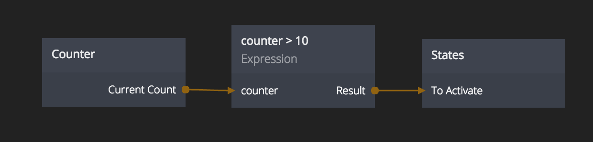

# Expression
Do your own calculations using simple expressions

## Inputs

Inputs are automatically derived from the expression. An expression set to `a + someName + 1` will
get two inputs, one for `a` and one for `someName`.

**Expression**  
The expression to be calculated

## Outputs
**Result**  
The result of running the expression

## Built in math functions
Expressions support the following funcitons:

- `min(a,b)` - Minimum of two values
- `max(a,b)` - Maximum of two values
- `cos(angle)` - The cosine of an angle in radians
- `sin(angle)` - The sine of an angle in radians
- `tan(angle)` - The tangent of an angle in radians
- `sqrt(a)` - Square root of a number
- `pi` - PI in radians
- `round(a)` - Rounds a number to the closest integer
- `floor(a)` - Removes the fractional part of a number
- `ceil(a)` - Rounds a value up to the closest higher integer. E.g. `round(1.1)` equals `2`.
- `abs(a)` - The absolute value of a number. Negative values will become positive.
- `random()` - A random number from 0 to 1

## Advanced
The *Expression* node is running Javascript under the hood so in addition to the above functions any standard
Javascript functions will also be valid. The *Expression* node will add a `return` statement before the
expression is executed. `1+2` will be evaluated as `return (1+2)`
