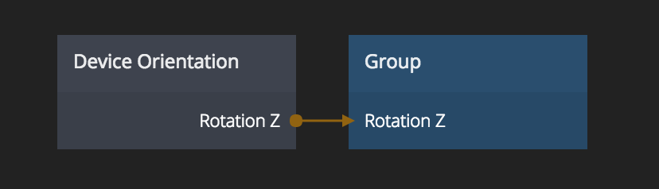

# Device Orientation

The orientation of a device. Works on phones, tablets and other devices with the required sensors.
The values can differ from browser to browser.

## Outputs

**Rotation X**  
The rotation around the X axis.

**Rotation Y**  
The rotation around the Y axis.

**Rotation Z**  
The rotation around the Z axis.

