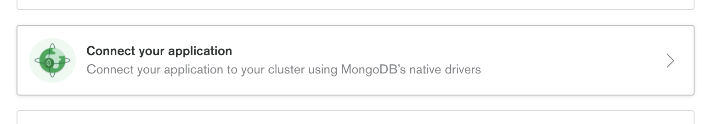
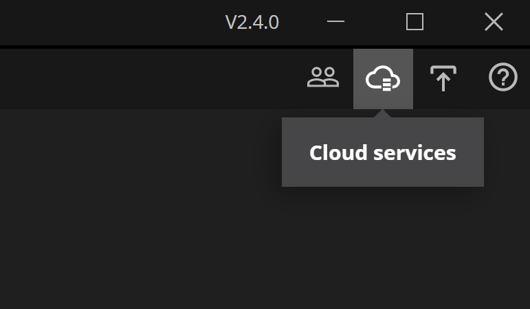
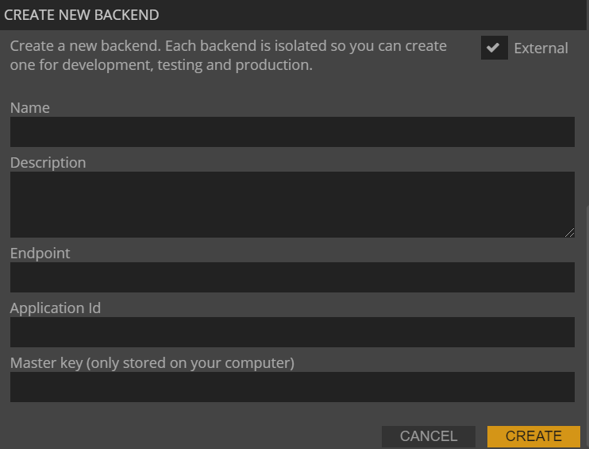

# Using and External Backend

## What you will learn in this guide
This guide will let you create an external backend with an external database through a **Docker Container**. This is an alternative to using an **Internal Backend**. Some reasons why you might want to do this could be

* You want to host your own database
* You want to host your own backend on a cloud service such as AWS or Google Cloud Platform
* You may want to add your own custom Cloud Functions or Database Triggers

## Overview

We will go through the follwing steps
* Set up a Database cluster on MongoDB Atlas
* Set up a Docker Container Image with a Parse Backend
* Run the Docker Container locally and connect to it from your Noodl App

## The different parts of a Noodl App

As a background it's good to know that a Noodl App consists of three parts:

* **The database** All Noodl applications must be backed by a database, you can use either a MongoDB or Postgres compatible database.

* **The backend service** Noodl applications natively support the [Parse Platform](https://parseplatform.org) which is a great choice for a backend service. A solid open source project with an active foundation supporting many of the critical functions needed.

* **Static frontend hosting** Noodl applications are SPAs (Single Page Applications) and need a place that serves the application frontend created when you deploy your application from Noodl.

This guide will look at setting up your own Database and Backend, and then run the backend as a **Docker Container**.

## The Database
You can choose any MongoDB or Postgres compatible database, for this guide we recommend using [MongoDB Atlas](https://www.mongodb.com/cloud/atlas) as it provides a free tier and you can choose to host it on GCP or AWS. You should always try to host your database using the same cloud provider as the backend service and preferably in the same region.

Follow the instructions to setup your account and spin up your database cluster. Once your database is up and running you need to get the connection details for the next step. In your cluster dashboard choose *Connect* and then you need to perform a few steps:

* Make sure your database can be reached from any IP. You can choose the option in the connection popup or add the IP *0.0.0.0/0* to the whitelist.

* Create a new database user that will be used to connect to the database. Give it a username and password and note these as you will use them later. (If you follow the instructions in the connection popup you will create an admin user, that's good it will be needed by the backend service. But make sure you keep the credentials safe.)

Then you can move on to choosing the type of connection.

<div class="ndl-image-with-background l">



</div>

In the next step you need to find the database connection URI, it will look something like this, replace username and password with the ones you choose above:

```bash
mongodb+srv://<username>:<password>@cluster0.xxxxxxx.mongodb.net/myNoodlDatabase?retryWrites=true&w=majority
```

Make sure you keep this URI safe as it includes everything you need to read and write to your database.

## The backend service
Next up we will deploy an instance of the [Parse](https://parseplatform.org) backend service that we will point our Noodl application to. For this we will need to install a few components first.

**Node.js**  
You will need *Node.js* and *Npm* installed on your system, you can find the latest versions here <a href="https://nodejs.org/en/download/" target="_blank">Node.js</a> and <a href="https://docs.npmjs.com/downloading-and-installing-node-js-and-npm" target="_blank">npm</a>

### Running a Noodl Backend in Docker

The first step is to run our backend as a a container image in [Docker](https://www.docker.com/). We will try connecting to our local Docker image and the we can deploy it to GCP or AWS.

Make sure to install the *Docker Desktop Tool* and to sign up for the *Docker Hub* as that will be needed later.

Conveniently, there is already a **Parse Platform** Docker Image we can use. You can read more about it [here](https://hub.docker.com/r/parseplatform/parse-server);

When we run the docker container we need to set up a few parameters, namely:
* Name of the backend - Pick whatever name you want, you need to match it when Noodl connects to this backend
* Masterkey - Pick whatever masterkey you want, you need to match it when Noodl connects to this backend
* Database URL and credentials from above

You run the docker container by starting a terminal window and run the following command

```
docker run --name my-parse-server -v config-vol:/parse-server/config -p 1337:1337 -d parse-server --appId <your app name> --masterKey <ýour master key> --databaseURI "mongodb+srv://<db user>:<db password>@<db url>"

```

If successful, you now have a Docker container running. You can double check in Docker that the container is running properly.

### Connect Noodl to the External Backend

You can now try connecting to your Docker container from Noodl. Go into you Noodl App. Make sure "Cloud backend" is turned on.

<div class="ndl-image-with-background m">



</div>

Create a new backend. Make sure the **External** checkbox is checked:

<div class="ndl-image-with-background l">



</div>

Fill out the information
* **Name** - Any name you want. This will be the name of the backend in the list of backends.
* **Description** - Some descriptive text of the backend.
* **Endpoint** - Should be "http://localhost:1337/parse"
* **Application id** - Should be the same as what you used when starting the **Docker** container
* **Masterkey** - Should be the same as what you used when starting the **Docker** container

Now your app should be connected to the external backend running locally in your Docker container. You can make some quick tests, for example opening the **Dashboard** and create a **Class** to see that it works.
