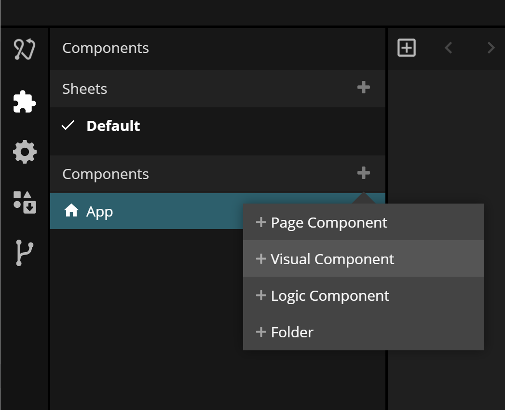
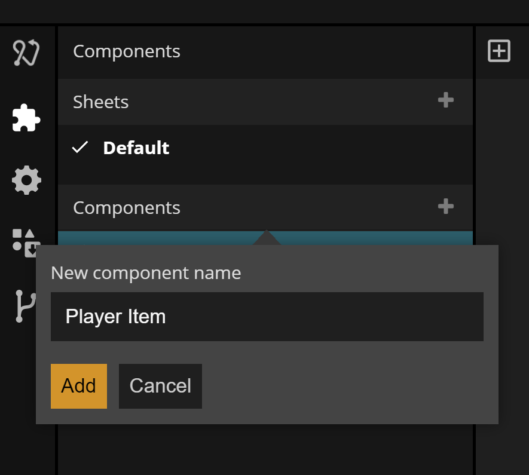
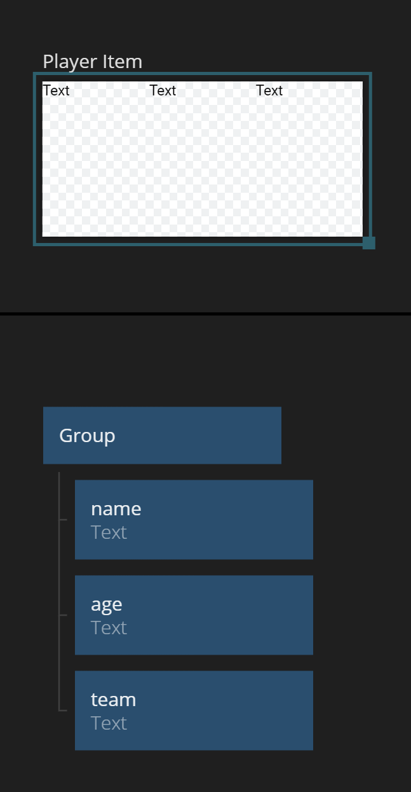

# List Basics

## What you will learn in this guide
This guide will teach you how to create basic lists in Noodl using the [Repeater](/nodes/ui-elements/repeater/) node that is being fed through an [Array](/nodes/data/array/array/). It will show how to create a simple list item and how to detect that the user clicks it.

## Overview
The guide will walk you through the following steps.

* The **Repeater** node
* Creating a simple **List Item** component
* Capturing when the user clicks an item

## The Repeter Node
The main node for making lists is the **Repeater** node. The **Repeater** node takes an **Array** as an input (the **Items** property). It then and creates a copy of the provided **List Item** template as a component and connects the specific **Object** (or **Record**) in the **Array** with its respective **List Item**.

The **Array** could for example be coming from an [Array](/nodes/data/array/array/) node, from a database through a [Query Records](/nodes/data/cloud-data/query-records/) or a [Static Array](/nodes/data/array/static-array/).

Let's get started by starting a new project using the "Hello World" template. Remove the **Text** node and add in a **Repeater** node instead.

<div class="ndl-image-with-background">


</div>

The **Repeater** needs two things to work.
1. Some **Array** data that can be represented as _List Items_
2. A _Template component_ that will be repeated per item in the **Array**

We will start with the **Array**. In this case we will use the **Static Array** might as well be some other node that outputs an **Array** for example a [Query Records](/nodes/data/cloud-data/query-records/) node that queries records from a database. There is a specific guide for working with **Query Records** [here](/guides/working-with-data/cloud-data/query-records/).

## Providing Items

So create a **Static Array** node. Change its type to ``JSON`` and paste in the following data.

```json
[
    {"name":"Peter Reid", "age":29, "team":"Everton", "position":"Midfield"},
    {"name":"Chris Waddle", "age":25, "team":"Tottenham", "position":"Midfield"},
    {"name":"Mark Hateley", "age":24, "team":"Milan", "position":"Forward"},
    {"name":"Peter Beardsley", "age":25, "team":"Newcastle", "position":"Forward"},
    {"name":"Kenneth Sansom", "age":27, "team":"Arsenal", "position":"Defender"}
]
```

<div class="ndl-image-with-background l">


</div>

Connect the **Items** output of the **Static Array** to the **Items** input of the **Repeater** node.

<div class="ndl-image-with-background l">


</div>

Now we have items flowing in to the repeater.

## Create a List Item Template
Next step is to create a component that can serve as a template for the **Repeater** so it can create one instance of it per list item.

Create a new Visual Component. Call it "Player Item".

<div class="ndl-image-with-background">



</div>

<div class="ndl-image-with-background">



</div>

In the new component we will add in three [Text](/nodes/ui-elements/text/) nodes that will present the information about each player. Make sure to change the layout of the root node to ``Horizontal`` and add in the three **Text** nodes. Call the **Text** nodes, ``name``, ``age``, ``team`` so we can keep track of them. Note that you can use the Canvas view to get a first view of how your list item will look, even before using it in your **Repeater**.

<div class="ndl-image-with-background">



</div>