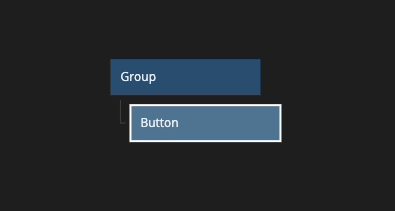
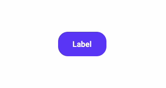
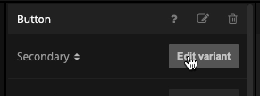
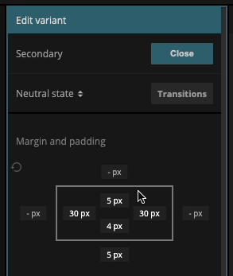

# Style Variants

## What you will learn in this guide

When building apps it’s very common that we need the same styling in multiple places. This guide will take you through the most common method of reusing styles, using the Style Variants feature.

## Overview

We will go through the following steps in this guide:

-   Create a Style Variant
-   Learn the differences between overrides and variants
-   Edit a Style Variant

## The quick and dirty method

We could just copy and paste a node we styled, but that comes with a couple of downsides.

First of all, we would have to search through all of our pages and components looking for the styled visual node we want whenever we need to include it in a new place.

Similarly, if we would find that the design needs to be tweaked, we would have to go through all pages and components, manually updating every instance of this copied node.

The better way to achieve reusability and maintainability is by using Style Variants.

## Creating a Style Variant

Let’s see it in action. In our design system we have a “Primary” button used to indicate the main actions, and a “Secondary” button that is a bit more discreet. Let’s build them, and use them in our app.

We start by creating a button in the node tree.

We will add a bit more left and right padding, increase the height and make the corners rounder.

That looks good. Now let’s create another button.

Oh, wait. Why does the new button not have any of the changes that we made? This is because we didn’t save the changes as a variant, so they became overrides on this specific instance of the button, instead of being attached to all the Button nodes.

Let’s fix this and save our changes as a variant so that we can start reusing it.

At the top of our restyled buttons Property Panel, click the “plus”, “Create new variant”, give it a name and confirm.

This will take all the overrides, remove them from the current instance and save them as a new variant together with all other non-overridden properties.

We can now select the second button and set it to use the "Primary" variant.

## Editing a Style Variant

Now that we have the “Primary” button, let’s create the “Secondary” variant.

For demonstrational purposes I will show you another workflow so that you can pick the one you like the best. This method will also cover how to edit variants.

Since the “Secondary” variant is very similar to the “Primary” one we will create a button and set it to use the “Primary” variant. This way we don’t have to repeat any of the styling we’ve already done.

This time we will not override any styles though. Instead we’ll immediately create a new variant and name it “Secondary”.

We now have a “Secondary” variant that is identical to the “Primary” one.

As you already know, if we change any properties now it will count as overrides, and only be saved to this particular instance of the Button node. So, in order to edit the Variant and not the Instance, we press the “Edit variant” button.

Notice how the borders of the Property Panel become a helpful teal color. This is so that we remember that we are in the Variant editor.

Let’s give this variant a “Primary” colored text, a transparent background and a “Primary” colored border.

In the “Visual States” guide I got some feedback from my designer friend that I forgot to style the hover state, so let’s make them happy and update the hover styles this time. Let’s make the background a nice “Primary Light” color. All of the visual states are tied to a Variant and saved on it.

All changes done when editing a Variant are saved automatically, so we don’t have to do anything else now that we’re done with the styling, but if we for some reason want to go back to editing the instance, we can click the “Close” button to exit the Variant editor.

We can now populate our whole app with identical buttons, making sure that they always follow the styling defined in our brand guidelines. And if the guidelines would change, we can quickly edit a variant and have it be updated across our whole app.
