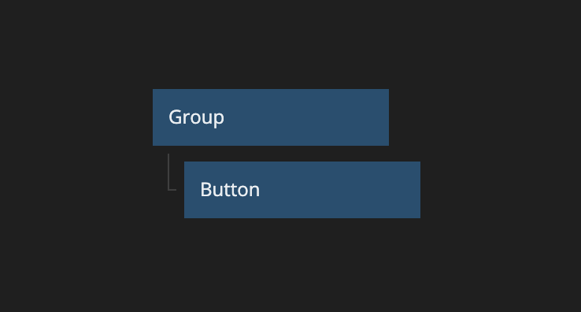
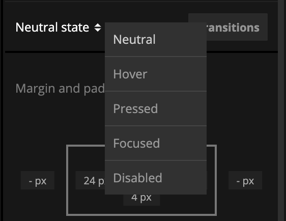
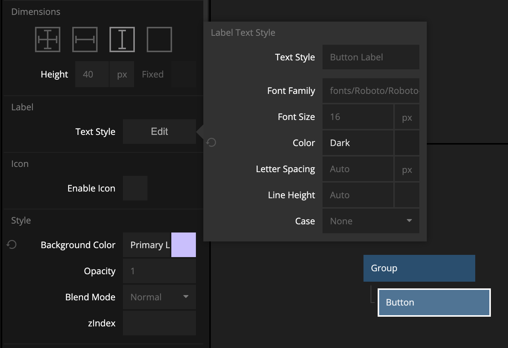
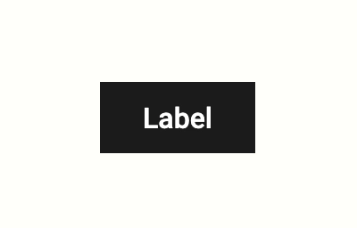

# Working with Visual States

When working with Visual nodes we often find ourselves in situations where we want to style the node differently based on the user interaction. We might want to have a different background color when hovering a button, or indicating that a checkbox has been checked. This is done using Visual States in the nodes settings in the Property Panel.

Let’s create a button in our node tree, and give it a quick styling.

Our brand guidelines tell us that all buttons need to be the Dark color and that they shouldn't have any rounded corners.

Ok, so, it looks good now, but when I sent it to my designer friend they told me that while the button looked good in the neutral state, it was all wrong when hovered. The button is supposed to be the Primary Light color, and the text should be Dark. Let’s fix that by modifying the Hover state.

With the Button node still selected, let’s move over to the Visual State selector and click the Hover option.

We will see the Property Panel shift around a bit. Some properties just don't make any sense to change in an interaction state, so Noodl will hide those properties for us.

Let’s scroll down to the properties for Label and Background Color and update them.

And voila - we are now following the brand guidelines.

