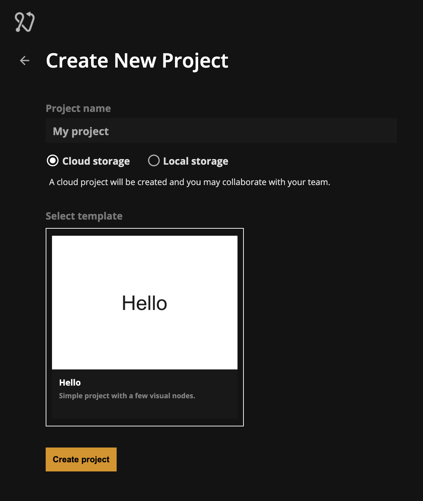

# Version control

## Introduction

Version control have three main use cases:

-   Collaborating with team members
-   Working with different versions of your project in parallel (what's known as "branches")
-   Backup. All versions are backed up in the cloud

Noodl uses [Git](https://git-scm.com) as the underlying version control system. Users comfortable with git can use external git clients to manage their Noodl projects. The project folder is a git repository.

## Enabling version control

Projects with "Cloud storage" selected will automatically get a version control repository in the cloud. Projects with "Local storage" will have version control disabled.

## The version control panel

The version control panel is where you perform all actions related to version control. This includes actions such as pushing new changes to your collaborators, pulling down the latest version, see differences between versions, merge branches and more.

## Pushing a new version

When there are changes in your project and you want to share them with your collaborators you click the "Push" button.

Noodl will now show you all the components and files that have changed, and by clicking them you can see the difference compared to the previous version.

After the changes are pushed you can see the new version in the version list.

## Pulling down changes

Noodl automatically checks if there are any changes to pull down when the version control panel is opened.

You can also manually check for updates by clicking the update icon

New version will show be displayed as dimmed items in the version list. These are versions that you haven't pulled down yet.

When you want to pull down changes you click on "Pull". Noodl will show you the changes you are about to pull in. Press "Pull" to download the changes.

Any local changes you have, that aren't pushed, will still be there after pulling down a new version. They will be applied to the new versions, which leads into the next subject, conflicts.

## Conflicts

Sometimes you and your collaborators might change the same parameter on the same node. In those cases Noodl doesn't know which change to apply, and will ask you to resolve the conflicts.

You can resolve conflicts by choosing to keep your change, or overwrite your change with the one from your collaborator.

## Branches

Branches can be used to develop different parts of your application in parallel, that can later be merged together.

Here are a few common use cases

-   One branch for the stable version of your app, and another one for the development version
-   A new feature that's being worked on can be developed in it's own branch, and later merged into the main branch when it's ready
-   Explore different designs variations of your app, deploying them independently, and later merge in the variation that was the most successful.
-   ...and there are many more

### Creating a branch

Create a branch by clicking the '+' icon in the version control panel's branch section.

After a branch has been created Noodl will switch to the new branch. Any changes in your project that weren't pushed will be moved to this new branch.

Changes you push will now belong to the new branch, and won't affect the other branches.

### Switching branches

Switch between branches by clicking on a branch. If there are local changes they will stay in the branch in which they were done, and won't move between branches.

### Merging branches

Changes from one branch can be merged into another branch. In this example the "my-new-feature" branch is being merged into the "main" branch.

Clicking "Merge into main" will show a preview of the changes that are being merged in. Noodl is visualizing the changes as they will look after the merge has been done.

Click "Merge" to perform the merge.

When the merge is done, it is done locally, and won't yet be shared with collaborators. You can now choose to push the changes, or reset all the changes and get back to the version before the merge, effectively undoing the merge.

#### Push the merge

Press "Push" to push the merge. Noodl will show you all the differences that you're about to push.

#### Undo the merge

You can undo the merge by clicking "View local changes" and then "Reset all changes".

## Deleting a branch

After a branch has been merged into another branch it can be a good idea to delete it if it won't be used anymore.

Note that deleting branches will delete branches both locally and remotely. If other collaborators has done work on the branch you just deleted, their local copy of the branch will still be intact and they can choose to push their changes to restore the branch again.

The main branch can't be deleted.

