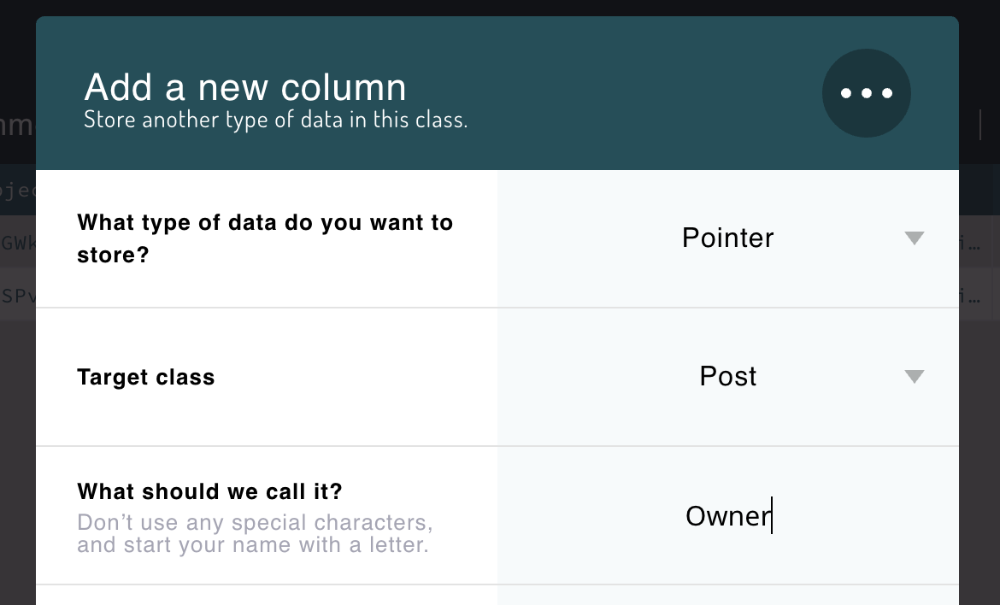
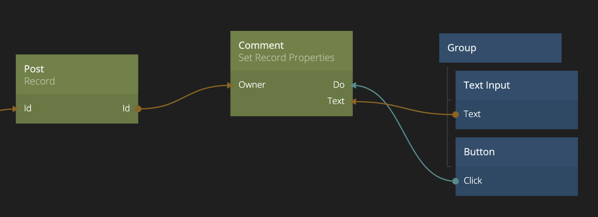
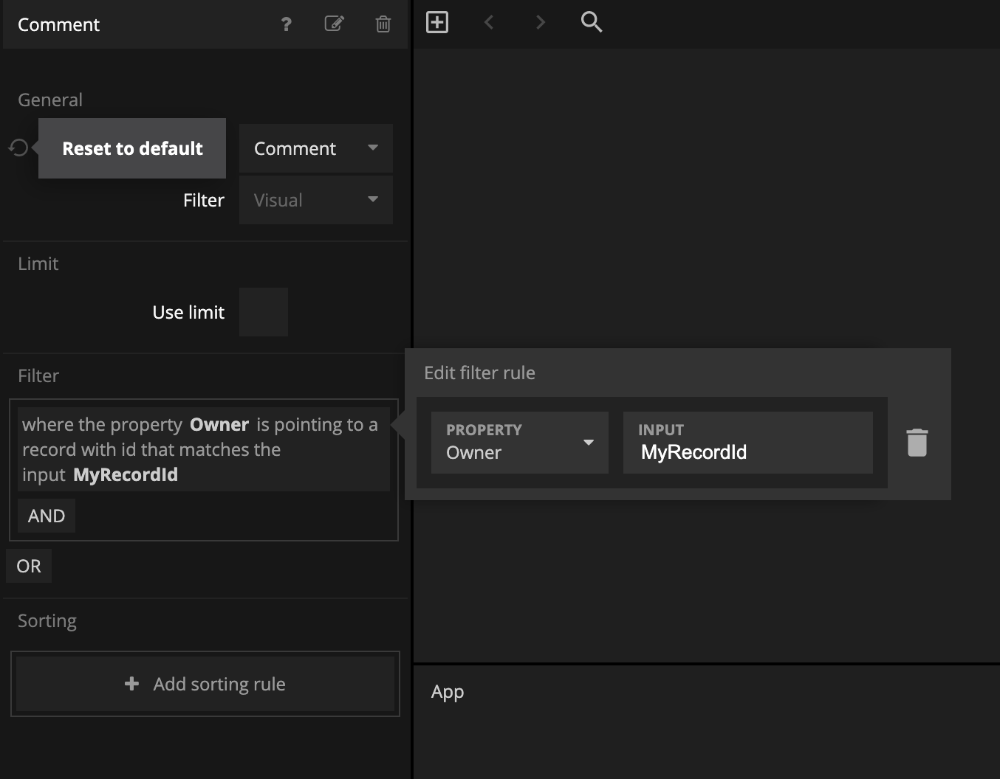
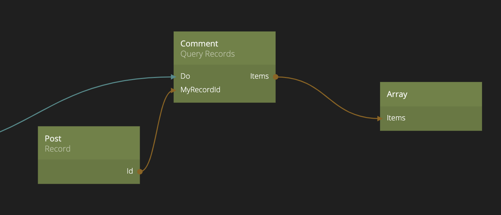
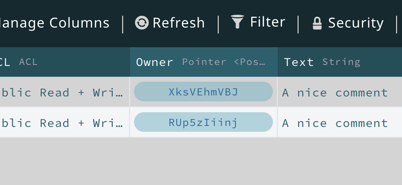
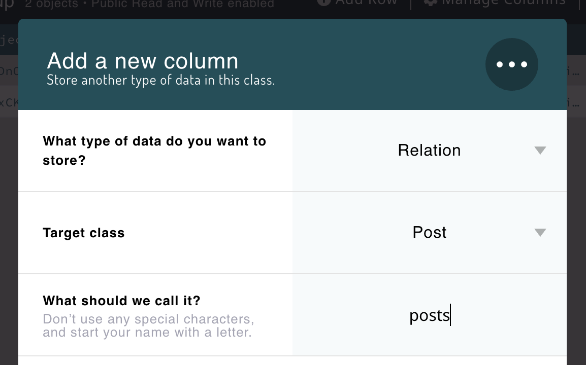
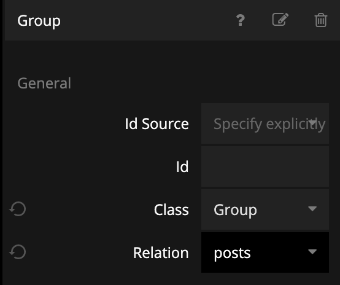
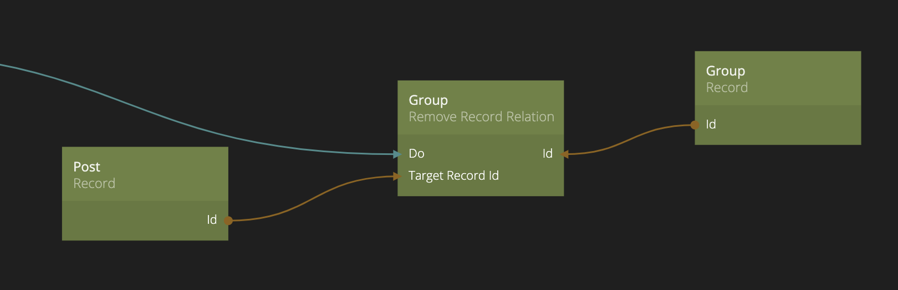
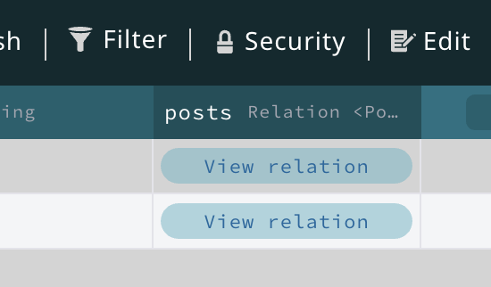
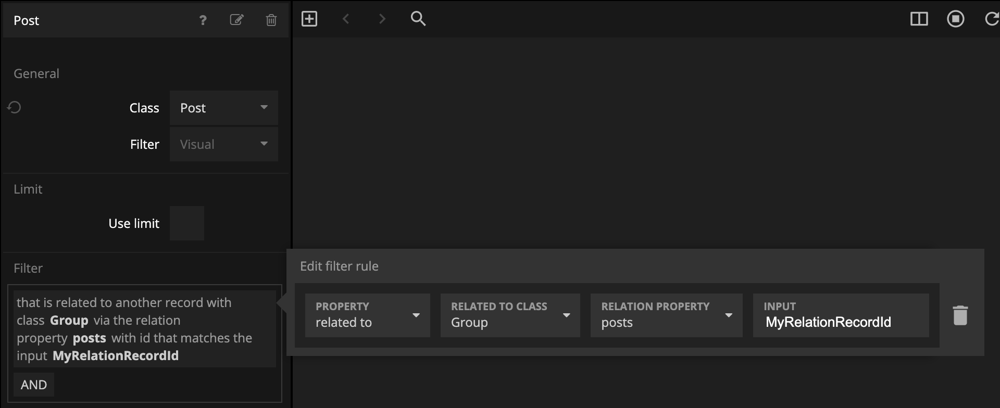

# Record Relationships

## What you will learn in this guide
In this guide we will look into relationships between different **Records** in the database. This could for example be a _pointer_ stored in a **Record** that points to another **Record**. It could also be a "Many to Many" relationship where an **Record** can have a list of _pointers_ to other **Records**.

This is very useful when you deal with _relational data_, for example if you have a Post **Class** in your database, and you want to keep track of all the **Users** (another **Class**) that liked that post, a **Post** record can store relations to those Users in a property.

## Overview

We will first look at **Pointers**, i.e. a _One-to-many_ relationship. Then we will look at **Relations**, i.e. _Many-to-many relationshipts_.

It's recommended that you have some experience working with Backends, Databases and **Records** to get most out of this guide, so if you haven't already, going through the following guides before is recommended.

* [Creating a Backend](/guides/working-with-data/cloud-data/creating-backend/)
* [Creating a Class](/guides/working-with-data/cloud-data/creating-class/)
* [Creating Records](/guides/working-with-data/cloud-data/creating-records/)

## Relationships between Records

If we imagine an App where we have a couple of different **Classes**, say a *Post* Class that contains blog posts and a *Comment* Class with comments on these post. The **Records** in these classes need to be related and we need to be able to query these relations.

## Pointers - One-to-many relationships
The most simple relationship is a **Pointer**. This type of relationship is often referred to as a _One-to-many_ relationship. For example, a blog *Post* will have many *Comment*s, but each *Comment* only belong to one *Post*. To create this kind of relationship we use a property of a special kind called a **Pointer**. 

A **Pointer** property can reference another **Record** of a certain Class via it's *Id*. In this case we want to reference the Post* that is the owner of a *Comment*. So in the *Comment* class we create a property, let's call it `Owner`, and give it a *Pointer* type and specify that it should point to *Post* records.

?> This is called a _backward_ relationship, i.e. the *Comment* points back to the *Post*. If you want to find all *Comments* for *Post* you will simply look for all *Comments* pointing back to the *Post* you are interested in.

<div class="ndl-image-with-background">



</div>

Now to set the pointer you can pass in the **id** of a **Post** Record. You could for example do this when you create a new *Comment* **Record** . It's important the the **Record** you point to is of the right type. In this case a *Post*.

<div class="ndl-image-with-background l">



</div>

Later, if you want to retrieve all the *Comments* for a *Post* you simply use a **Query Records** node and ask for all **Comments** where the **Owner** property points to the specific comment. 

<div class="ndl-image-with-background l">



</div>

The specific **id** we are looking for, we provide through an input.

<div class="ndl-image-with-background l">



</div>


You can inspect your relationships in the data browser, if you go ahead and open the *Dashboard* for the cloud services and find the *Comment* Class. There you can see the record *Id* that the pointer currently points to, and you can click it to jump to that particular record.

<div class="ndl-image-with-background">



</div>

## Relation - Many-to-many relationships

Let's say that we introduce a new **Class** called *Group*, and a *Post* can be part of many different *Group*s. In this case we cannot use the backwards pointing mechanism from the previous example. One single pointer from the *Post* to the *Group* would not work, since a *Post* can be part of many *Groups*. Instead we need to use a concept called **Relation**. You need to start by creating a new property of the *Group* **Record** that have the type *Relation* and like pointers you need to specify the *Type* and give it a name.

?> So in this case it becomes a *forward* reference, the *Group* has the relation property.

<div class="ndl-image-with-background">



</div>


When you have a *Relation* property on a **Record** you need to use the nodes [Add Record Relation](/nodes/data/cloud-data/add-record-relation/) and [Remove Record Relation](/nodes/data/cloud-data/remove-record-relation/) to manage them. In these nodes you need to provide the **id** of the **Record** that has the relation property (Group in our case) and the **id** of the **Record** you want to add or remove to the relationship.

<div class="ndl-image-with-background">



</div>

<div class="ndl-image-with-background l">



</div>

In the same manner as with *Pointers* you can go to the *Dashboard* of the cloud services and find the relations of your models in the table. You can click *View relation* to get a table of the relations for this particular model.

<div class="ndl-image-with-background">



</div>

Finally you need to be able to query the relations. You have two cases:

1) Either you want to find all *Post* that are related to a *Group*. The you should create a **Query Records** of the class *Post* (you want *Posts* back from the query). You can then set up the filter according to the image below

<div class="ndl-image-with-background l">



</div>

Note that you have to specify the name of the relation property in the class having the property (*Group* in this case) as well.

<!--

If you want to make the inverse query, that is you want to ask for all *Groups* that relates to a post, you create a **Query Records** node with the class *Group* (you want *Groups* back from the query). have a *Post* **Record** (you have the *Id* of a *Post* **Record**) and you want to find all *Group*s that it belongs to you would use this javascript query in a **Query Records** that is set to the **Group** class.

```javascript
where({ 
    posts: {pointsTo:Inputs.PostId}
})
```

As you can see above you must also make sure that you use the correct relation field, in this case *posts* on the *Group* collection.

-->