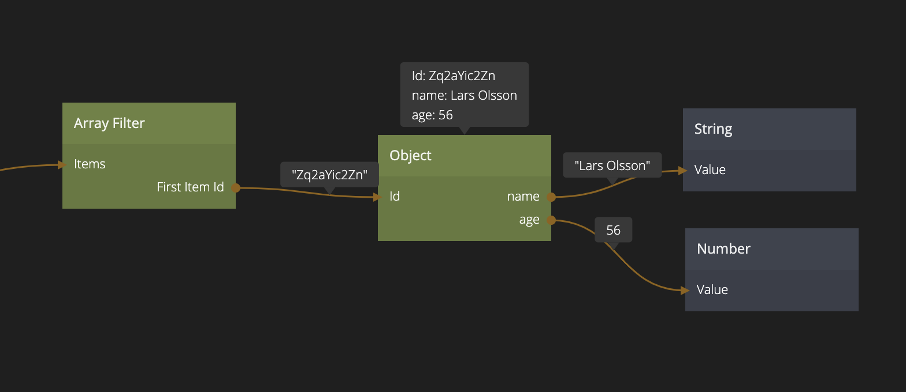
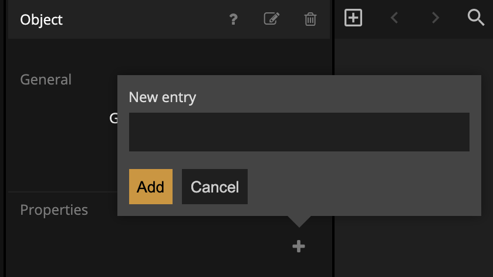

# Using Objects

## What you will learn in this guide
In this guide you will learn how to use the [Object](/nodes/data/object/object/) node, the [Create New Object](/nodes/data/object/create-new-object/) and the [Set Object Properties](nodes/data/variable/set-object-properties/) node to create and store **Objects** in your app. Objects are _local_ meaning they will not be stored in a database. They are very useful to store data and states that applies to a usage session of an app or a screen. They are also essential when working with **Arrays** in Noodl since only **Objects** and **Records** can be stored in a Noodl Array.

## Overview
The guide covers the following topics
* Objects in Noodl
* Creating **Objects**
* Setting Properties in **Objects**
* Dynamically creating Objects using the **Create New Object** node.

**Objects** are very similar to **Variables** in Noodl and it's recommended to go through the [Variable guide](/guides/working-with-data/local-data/using-variables) before reading this guide.

## What's an Object in Noodl?
**Objects** in Noodl are used to hold data. **Objects** are _local_ meaning they only exist while the App is running. This is the main difference between **Objects** and [Records](/nodes/data/cloud-data/record/) - **Records** are stored in a database.

Another related node in Noodl is the [Variable](/nodes/data/variable/variable/) node. It's also local, but can only store one value, while an **Object** can store a number of values, each in a _property_. So essentially an **Object** holds a couple of data points (properties) that belong together.

Some typical cases could be information about a person (for example `First Name`, `Last Name`, `Address`, `Age`), all the information about a football match (`Home Team`, `Away Team`, `Match Date`, `Score`), etc, etc. There is no limitation on how many properties you can have or what types the properties should be.

### Noodl Objects vs Javascript of JSON objects

If you are familiar with Javascript or JSON you are probably used to work with Objects. You can think of Noodl Objects as very similar to Javascript/JSON objects but they are not exactly the same. Many Noodl nodes will convert Javascript/JSON object to Noodl objects automatically. For example if a JSON object is returned from a REST call using the [REST node](/nodes/data/rest/) it will come out as a Noodl **Object** from the **REST node**.

### The `id` of an Object
All **Objects** in Noodl have an **id**. This is the unique identifyer of the **Object** and if you have two **Object** nodes in your app, and you give them the same **id** they will point to the same data. Changing properties on one of the nodes will immediately change the data any other **Object** node with the same id.

In Noodl, when a **Node** need to refer to an **Object** the id of the object is given. For example, an **Array Filter** have an output called **First Item Id** which will hold the **id** of the first object in the resulting array of object after a filter action have been done. By connecting that **First Item Id** to the **Id** of an **Object** you can access its properties.

### The properties of an Object
An Object typically have a number of properties. on the **Object** node they have to be explicitly created to be able to access them as outputs and inputs by clicking the `+` in the properties panel. 

Note that just because an Object node doesnt have a property created doesn't mean that the underlying **Object** don't have the properties. It's just that this particular node won't have the property available as input and output available until you add them.

## Creating Objects

Let's get started!