# Using Variables

## What you will learn in this guide
In this guide you will learn how to use the [Variable](/nodes/data/variable/variable/) node and the [Set Variable](nodes/data/variable/set-variable/) node to store data in your App for later use. Variables are _local_ meaning they will not be stored in a database. They are very useful to store data and states that applies to a usage session of an app or a screen.

They can also be used to help create conditional logic in your app, for example a Variable gets value X in one condition or value Y in another condition.

## Overview
The guide covers the following topics
* Setting variables
* Reading variables
<!--
* Accessing variables globally
* Using variables with conditions -->

## When to use Variables?
When developing an app, you often run into the situation that you need to hold on to a value - a piece of data - and use it at a different place in your app.

For example, you may have a [TextInput](/nodes/ui-elements/text-input/) where the user can input their name. You want the name first letter of the name to be always capitalized, no matter what the user inputs. This name should be used through out the App. Hence you would like to store it so you can retrieve it on various places in the app.

You cannot really make a connection directly from the **TextInput** node to all the places where the name will be used. First of all, there might be too many of those connections. Second of all, the nodes that need the name are maybe not in the same component so you can't really reach them. And lastly, you don't want the intermittent name, while the user is entering it, you only want it when the user is done, and then you want it with a capital first letter and not exactly how the user wrote it. This is use one case of many, where a Variable comes in handy.

## Storing and reading variables

Let's start by opening a new project. You can base it on the Hello World template. Then add a **TextInput** node. Change its' label to "Name". You may want to add a little bit of padding to the parent container as well, to make sure the **TextInput** get some air around itself.

<div class="ndl-image-with-background">

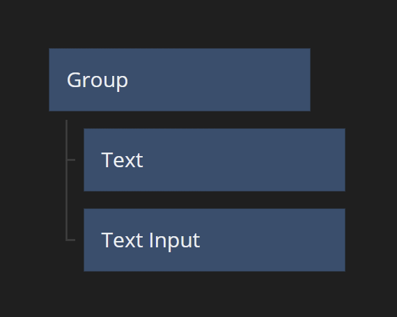

</div>

<div class="ndl-image-with-background">

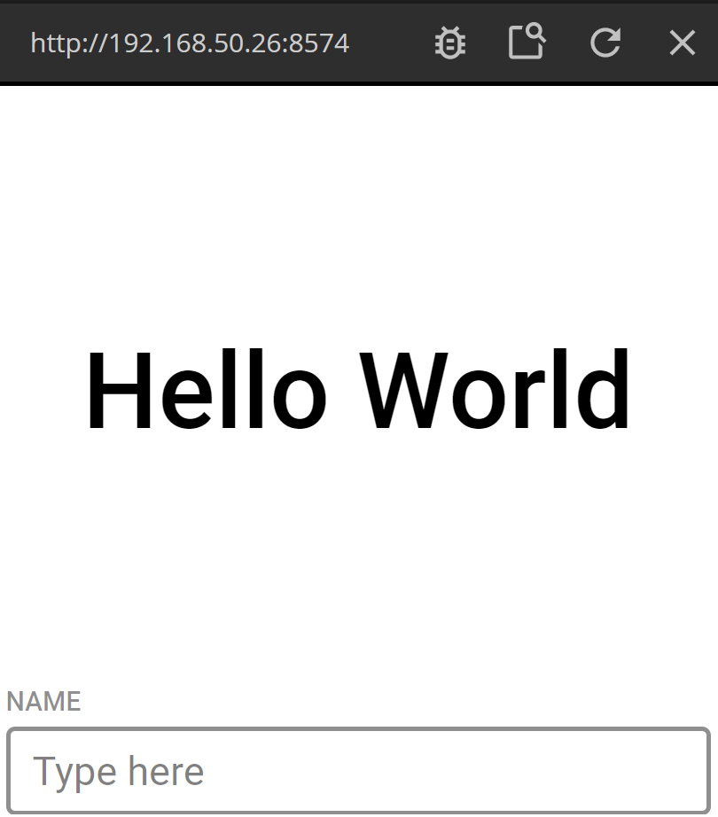

</div>

Now we are going to do two things. 1. We want to store the value of the TextField in a **Variable** node when the user hits _Enter_. 2. We also want to capitalize the first letter of the name, before we store it.

Let's start with the capitalization. Add a [Function](/nodes/javascript/function/) node. Edit the script and paste the following:

```javascript
if (Inputs.name !== undefined) {
    Outputs.capitalizedName = Inputs.name.substr(0,1).toUpperCase()+Inputs.name.substr(1);
}
```

<div class="ndl-image-with-background l">

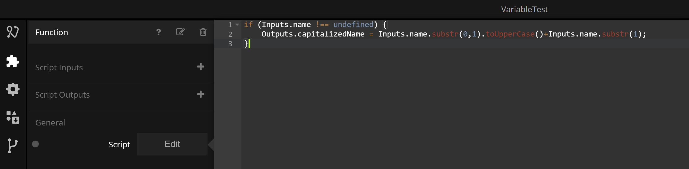

</div>

It's not important right now that you understand exactly how the Javascript works, but it will capitalize the first letter of what you feed into the **Function** node and set it on the output named `capitalizedName`.

Connect the **Text** output from the **TextInput** node to the **name** input on the newly created **Function** node.

<div class="ndl-image-with-background l">

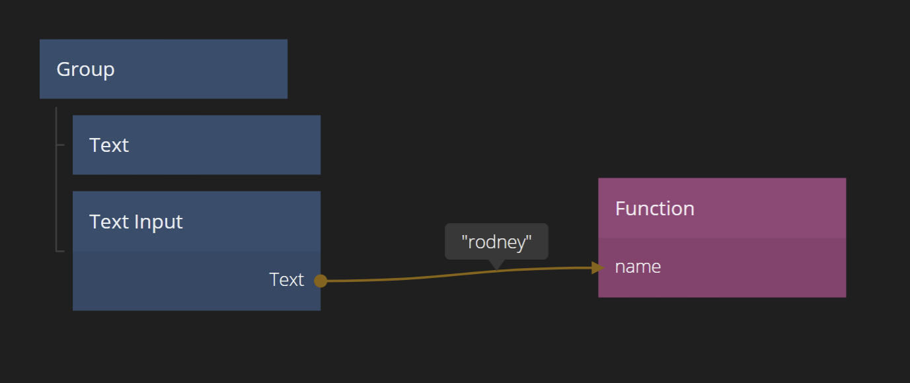

</div>

### Setting a Variable

Ok so let's store the capitalized name in a **Variable**. To do this, add a **Set Variable** node. 

<div class="ndl-image-with-background l">

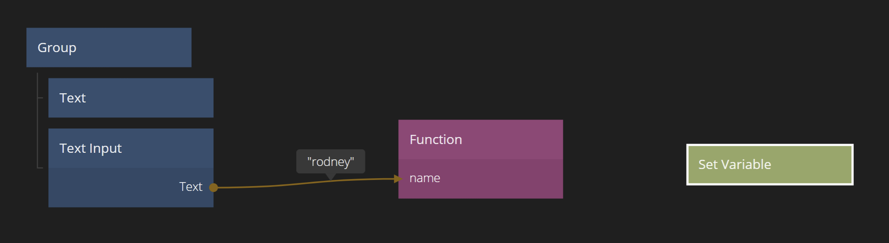

</div>


### The Variable Name
Each variable need a **Name**. Any **Variable** or **Set Variable** node anywhere in your App that has the same **Name** will refer to the same actual data. The **Name** is case sensitive, and we are going to pick the name `userName`.

We will also set the type of the **Variable** to a **String**. This is important, for example, if the user chooses a username which are only numbers. With the **String** type set, we know even in that case, what's stored in this **Variable** is a **String**.

<div class="ndl-image-with-background">

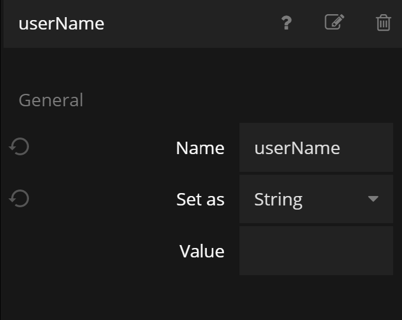

</div>

Then connect the `capitalizedName` output from the **Function** node to the **Value** input of the **Set Variable** node.

<div class="ndl-image-with-background l">

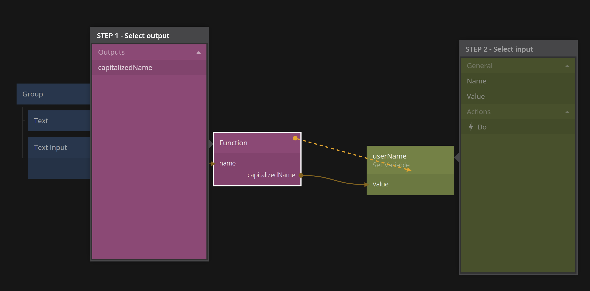

</div>

<div class="ndl-image-with-background l">

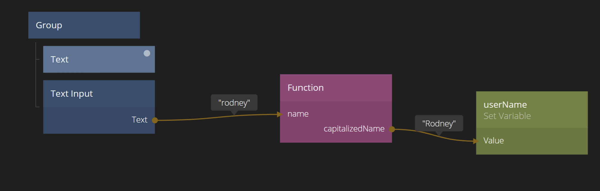

</div>

We have one more thing we need to do to actually store the value in the **Variable**. We need to trigger the **Do** signal in the **Set Variable** node. This makes it possible for us to control exactly what we save. Again, as the user is typing in the **TextInput** the `capitalizedName` output will keep updating (try it!) and we only want to save once the user press _Enter_.

So, connect the **onEnter** output on the **TextField** to the **Do** input signal on the **Set Variable** and we are done with storing data in a **Variable**.

<div class="ndl-image-with-background l">

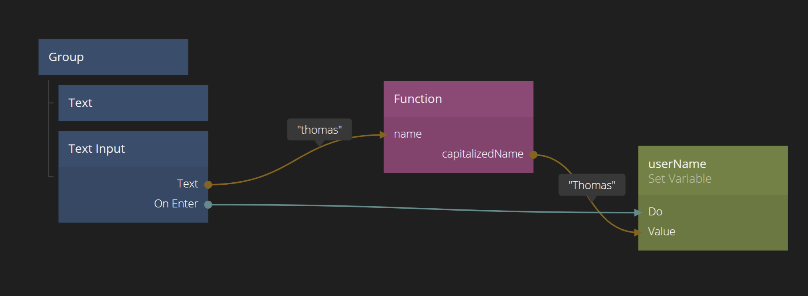

</div>

### Reading a Variable
Ok, now we want to use the value we just stored. We want to include the name in the `Hello World` greeting. So lets first add a [String Format](/nodes/string-manipulation/string-format/) node. Make sure the text in the node is "Hello World {name}".

<div class="ndl-image-with-background l">

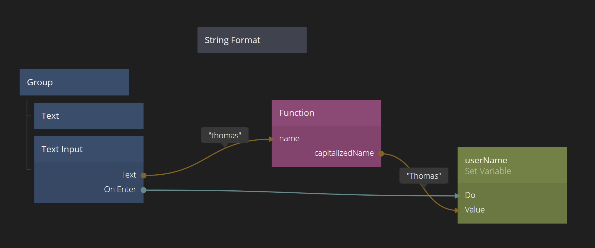

</div>

<div class="ndl-image-with-background">

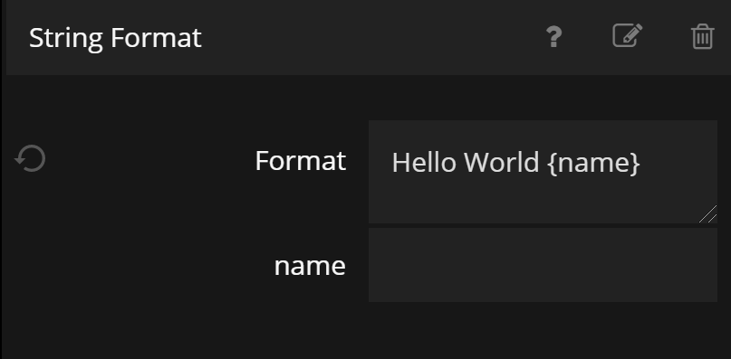

</div>

The **String Format** node now should have an input called **name**.
Create a **Variable** node. Make sure its' name is `userName` (it should pop up as a suggestion when you click the **Name** input in the panel), just as before. This **Variable** node will now refer to the same **Variable** as we were storing before.

Connect the **Value** output of the **Variable** to the **name** input of the **String Format** node. Finally, connect the **Formatted** output from the **String Format** node to the **Text** input on the **Text** node.

<div class="ndl-image-with-background l">

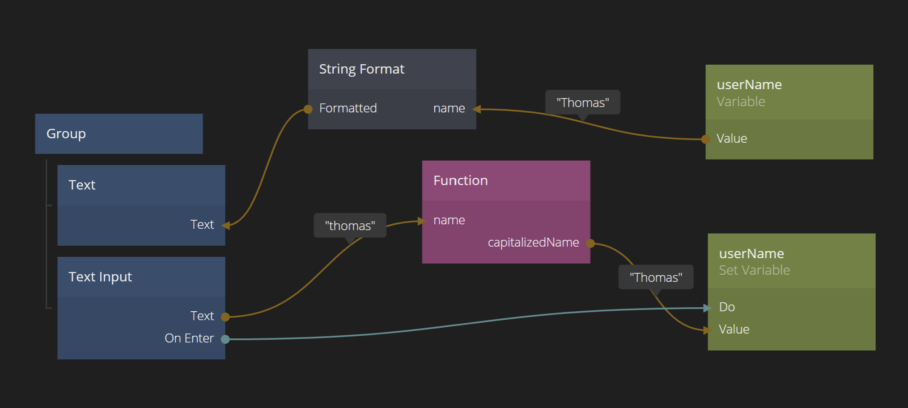

</div>

Now test your app. Start writing a name in the **Text Input**, press _Enter_ and you should see the "Hello World"-text changing.

<div class="ndl-image-with-background">

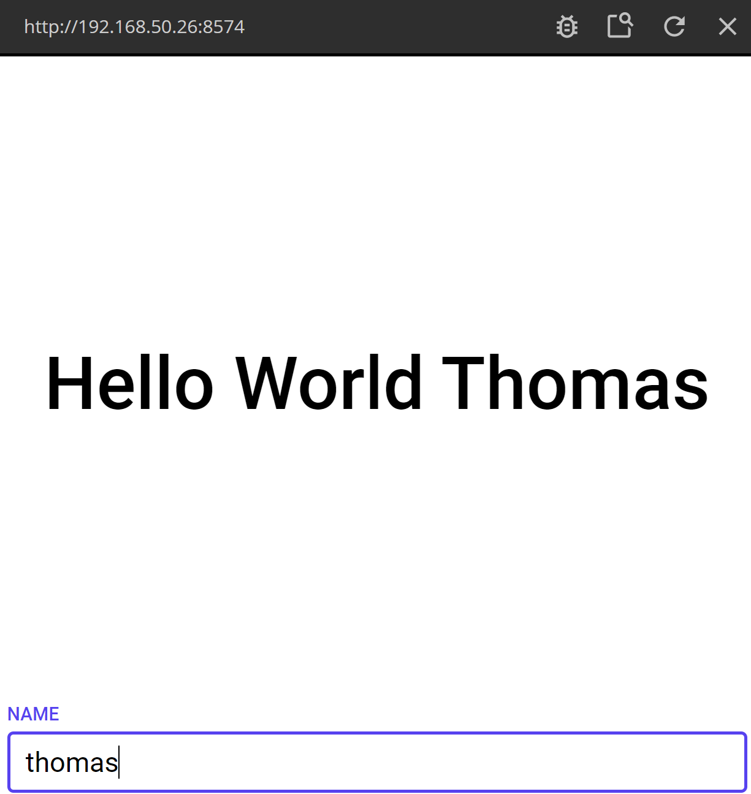

</div>

