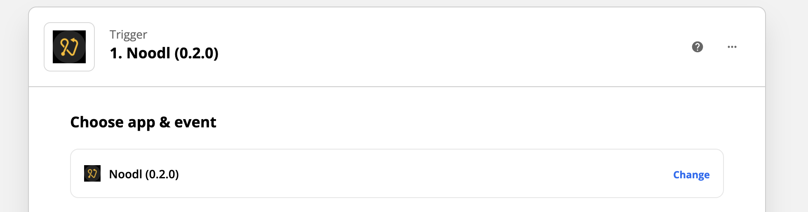
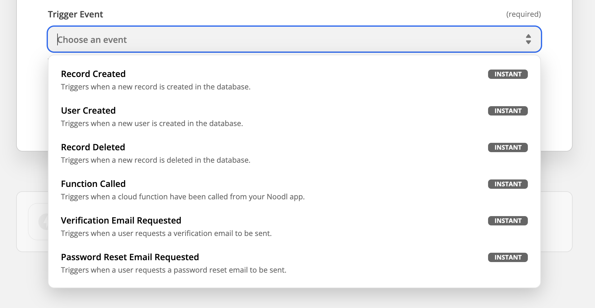
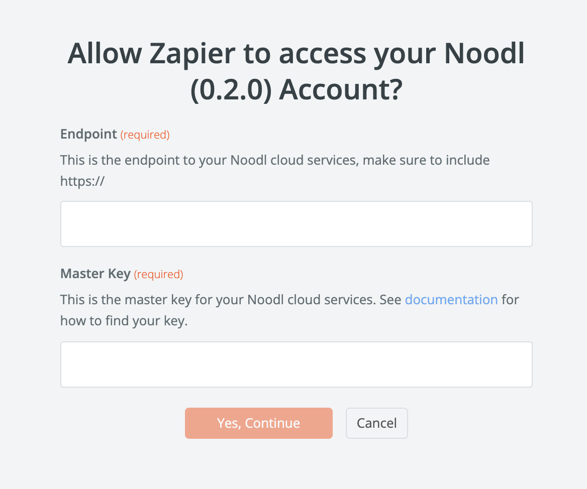
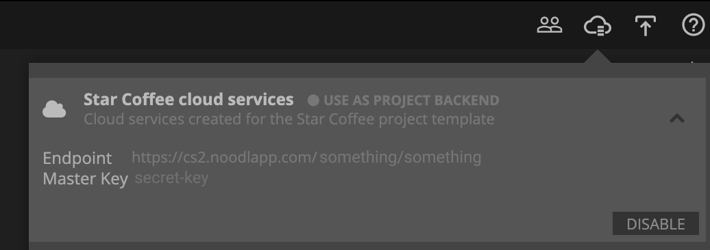
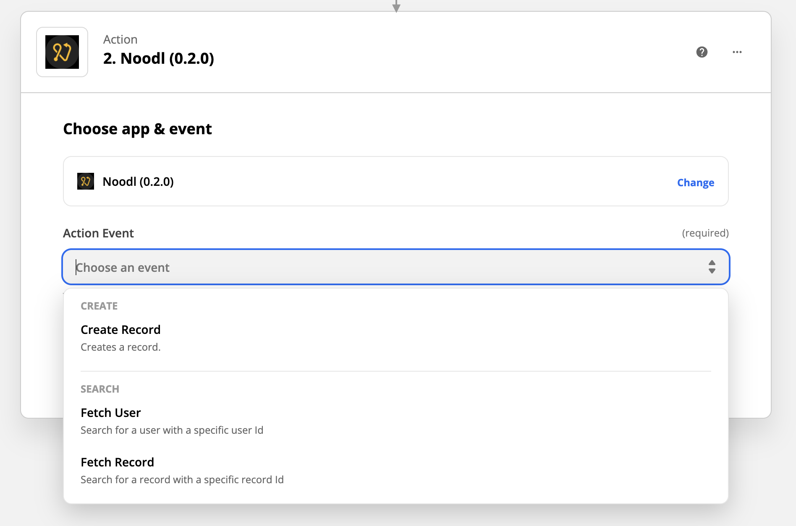

# Zapier

This guide will cover how to connect your Noodl application to **Zapier**. **Zapier** is a great platform for automatic tasks and connecting different cloud based applications. This can become very useful for Noodl creators as some tasks need to be performed in the cloud. After a used has signed in, you might want to send them a welcome email, or maybe on some sort of action like inviting a user to a team. Other features, such as payment, can be integrated into your Noodl app successfully using **Zapier**. So let's get started.

You connect **Zapier** to your Noodl cloud services, this is what you need to create users, write data to the cloud etc. If you don't know what that is I recommend that you start with the the cloud data [guide](/guides/working-with-data/cloud-data/creating-backend/). With your cloud services up and running you can start creating **Zaps**. For more information on **Zapier** and to start learning the basics go [here](https://zapier.com/how-it-works).

You start your new **Zap** by choosing the **Noodl** trigger. Here you first need to choose an event from the Noodl cloud services that will trigger your **Zap**.

There are a number of events to choose from:

To for instance send an email with a new user is created, pick the **User Created** event. Next up you need to connect **Zapier** to your Noodl cloud services.

Under **Choose Account** you will need to select **Connect new account** which will bring up the connection popup show below.

Here you need the cloud services endpoint and the master key. This will allow Zapier to connect to your applications cloud services and to perform tasks on your behalf.

Simply copy the **Endpoint** and **Master Key** into the corresponding fields in the Zapier connection popup and hit **Yes, continue**. This should connect you to your cloud services.

That's it really. Now you can go on and hook up your Noodl application to all the good stuff in the **Zapier** integrations. But that's not the only thing you can do with Noodl and Zapier. There are also a bunch of actions that you can perform on your Noodl cloud services, perhaps as response to other Zapier events.

If you instead choose the **Noodl** app when creating an action you will have the following choices:

For instance, **Create Record** lets you create a new record in the database. This can be useful to support payment flows, where the payment service will trigger an event in Zapier when a payment is performed and you can then insert the payment in your database.

Another example is that for some tasks you might want to make sure that the user has the correct access level before performing the task. You can do this by issuing a function call to that triggers a Zapier **Zap** that contains the **Fetch User** action. This will allow you to examing the fields of the user and only perform the action if the user has the correct credentials.

There are endless ways you can extend your application by running **Zapier** tasks and this is an integral part of may application flows.

