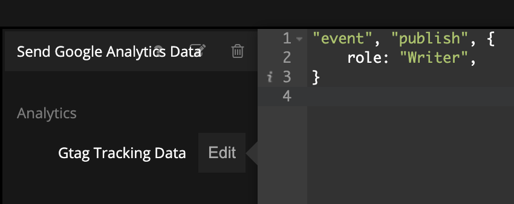
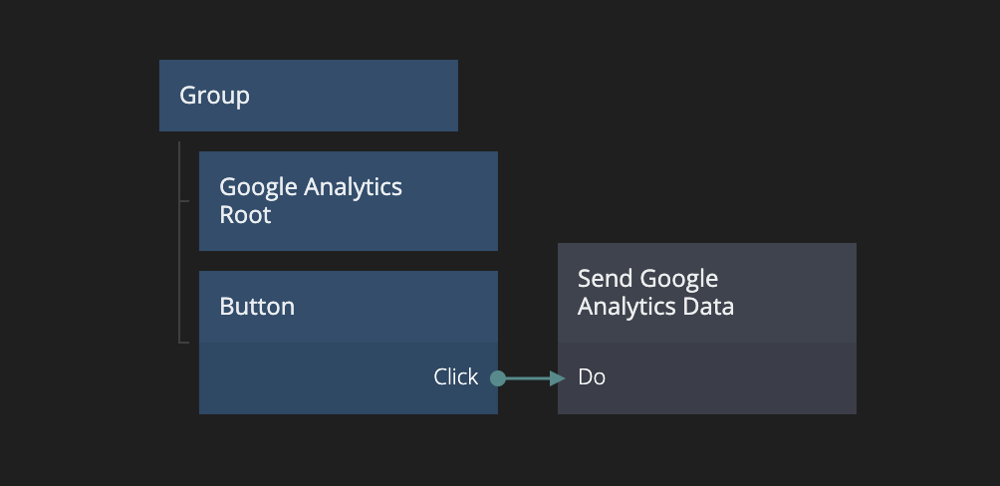
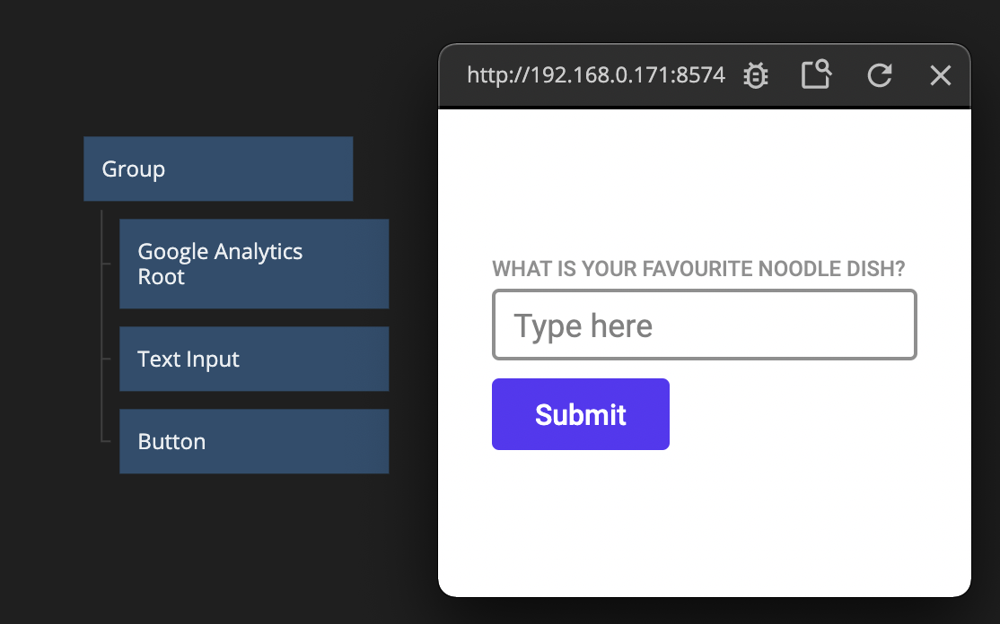
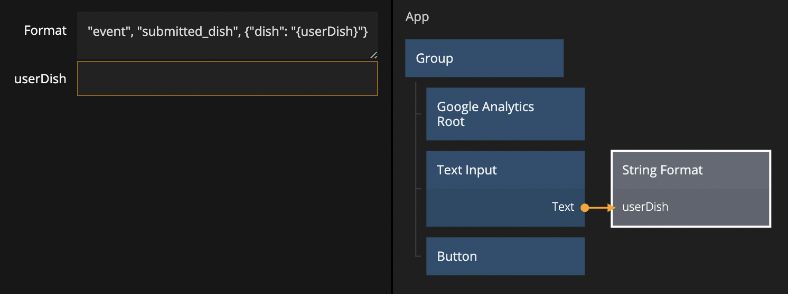
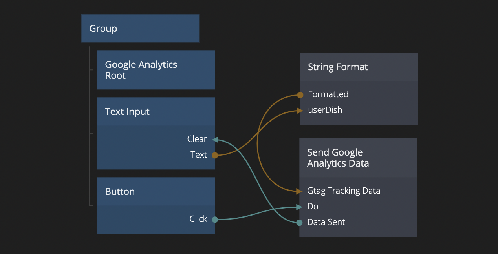

# Tracking custom events in Google Analytics

## What you will learn in this guide

This guide will take you through the process of setting up and tracking custom events in Google Analytics. It is recommended that you take a look through the [setup guide](modules/google-analytics/guides/setting-up-google-analytics/) before reading this one.

## Overview

We will learn about the following things:

-   Sending static data
-   Sending dynamic data based on user input

## Sending static data

To send custom events we use the **Send Google Analytics Data** node.

The **Send Google Analytics Data** node is built on top of Google's own `gtag` function, meaning that all _Google Analytics 4_ documentation you see that uses `gtag` can be directly copied and pasted into the node.

In Google's own documentation on [sending events](https://support.google.com/analytics/answer/11147304) we can find the following code in the section named "Send an event":

<!-- prettier-ignore-start -->
```html
<script>
    gtag("event", "publish", {
        role: "Writer",
    })
</script>
```
<!-- prettier-ignore-end -->

We can copy the data passed to the gtag function and paste it directly into the <span class="ndl-data">Gtag Tracking Data</span> input in the **Property Panel** for the **Send Google Analytics Data** node, like so:

<div class="ndl-image-with-background">



</div>

We can now submit the data to Google by sending a signal to the nodes <span class="ndl-signal">Do</span> input.

<div class="ndl-image-with-background l">



</div>

We have now successfully tracked our first custom event!

## Sending dynamic data based on user input

In some cases we want to provide more in depth data that might be dependent on specific user input. In this case we can use the **String Format** node.

Let's build a small app that tracks the user's favourite type of noodle dish. We'll use a **Text Input** and a **Button** to build a tiny form.

<div class="ndl-image-with-background l">



</div>

We are now ready to add the tracking.

Create a **String Format** node and open up it's **Property Panel**. In the <span class="ndl-data">Format</span> input we can now write our custom event.

<!-- prettier-ignore-start -->
```js
    "event", "submitted_dish", {"dish": "{userDish}"}
```
<!-- prettier-ignore-end -->

The `{userDish}` part of this code will create an input named <span class="ndl-data">userDish</span> on this node. We can now send the <span class="ndl-data">Text</span> from **Text Input** to the <span class="ndl-data">userDish</span> input on **String Format**.

<div class="ndl-image-with-background l">



</div>

!> It is **very important** that the `{userDish}` is in quotation marks if the value is a <span class="ndl-data">string</span>, otherwise the tracking will fail. <span class="ndl-data">Numbers</span> can be unquoted.

Now we need to send this data to Google. Create a **Send Google Analytics Data** node, and connect the **String Format** <span class="ndl-data">Formatted</span> output to the **Send Google Analytics Data** <span class="ndl-data">Gtag Tracking Data</span> input, and the **Button** <span class="ndl-signal">Click</span> output to the **Send Google Analytics Data** <span class="ndl-signal">Do</span> input. We will also connect the <span class="ndl-signal">Data Sent</span> output from **Send Google Analytics Data** to the **Text Input** <span class="ndl-signal">Clear</span>, to visually indicate that the data has been sent.

<div class="ndl-image-with-background l">



</div>

We have now successfully tracked the users favourite noodle dish! Hop on into the Google Analytics Reports view and use this knowledge responsibly.
