# Park Details View

## What you will learn in this guide
This guide will continue to explore how we can build front ends to data from Google Sheets. 

## Overview
If you haven't already looked at the guide for setting up the Google Sheets Module, it's recommended to do that before starting this guide. You can find it [here](modules/gsheets/guides/setting-up/).

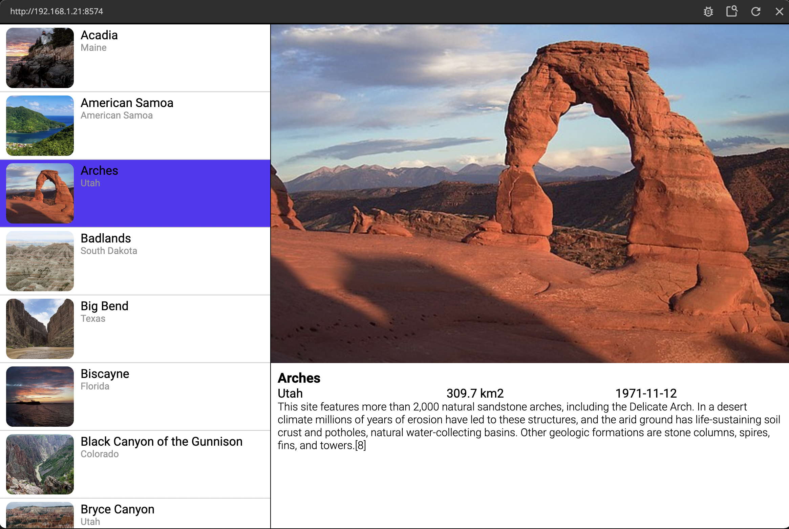

We will go though the following steps:
* Using the Sheet Row node.
* Building a simple details view for data from a Google Sheet

## Creating the Park Details component

First let's create a new visual component that we will call Park Details.

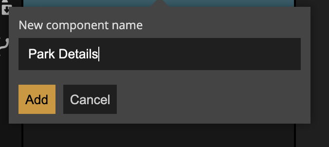

Then, build out the following visual tree and then we will look at the properties for each node.

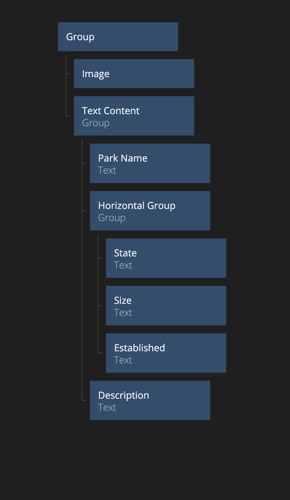

First the properties for the top group, and the only thing that is different from the defaults is the white background:

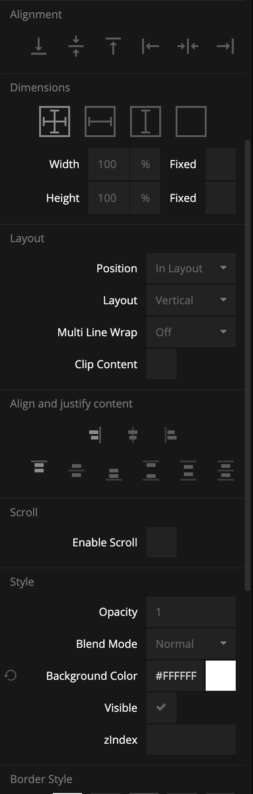

Next we have the Image node which is setup like this:

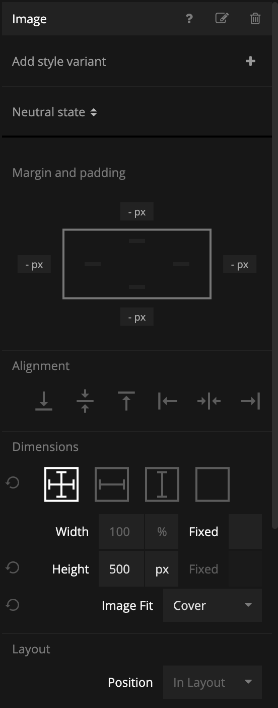

The Group that we have called Text Content, only has some padding set:

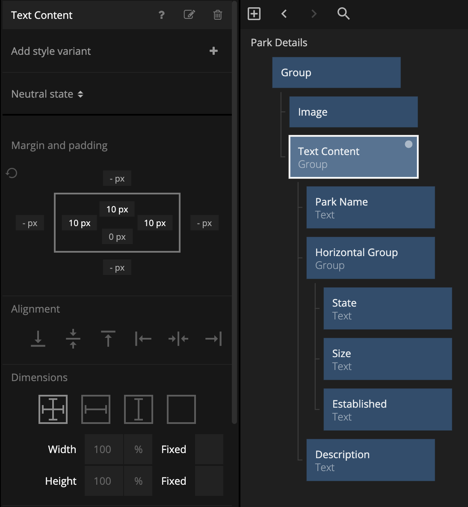

We will be displaying the park name in the Text node that we call just Park Name, and the properties for that node are as follows:

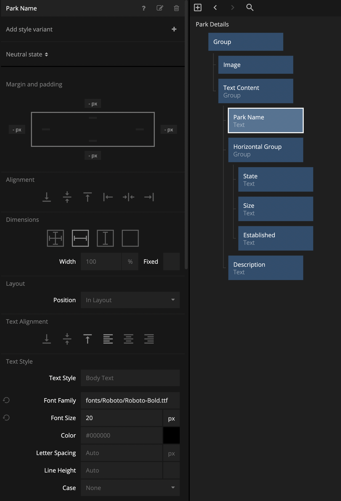

There is another group in our tree, the Horizontal Group, that we use to lay out some of the other information, and the properties for this group are:

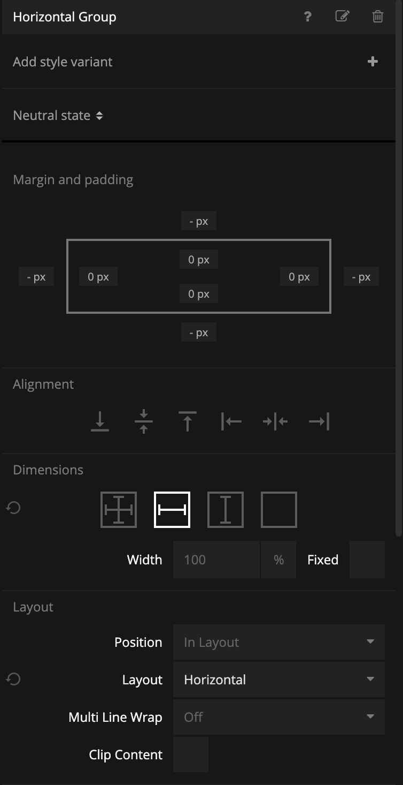

All three of the Text nodes that are inside of the Horizontal Group have the same styling which is the default styling of a Text node so there is no need to change any properties for these nodes.

Finally the Text node that we have named Description has the following styling:

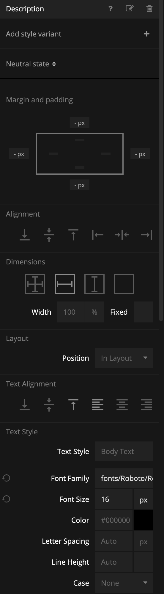

## Adding the Park Details to the App component

Now that we have built out and styled the visuals for our Park Details, let's add them to our App component. In the App component we will first add another group that we can call Details Container and then we add the Park Details as a child to that Group. It should look like this:

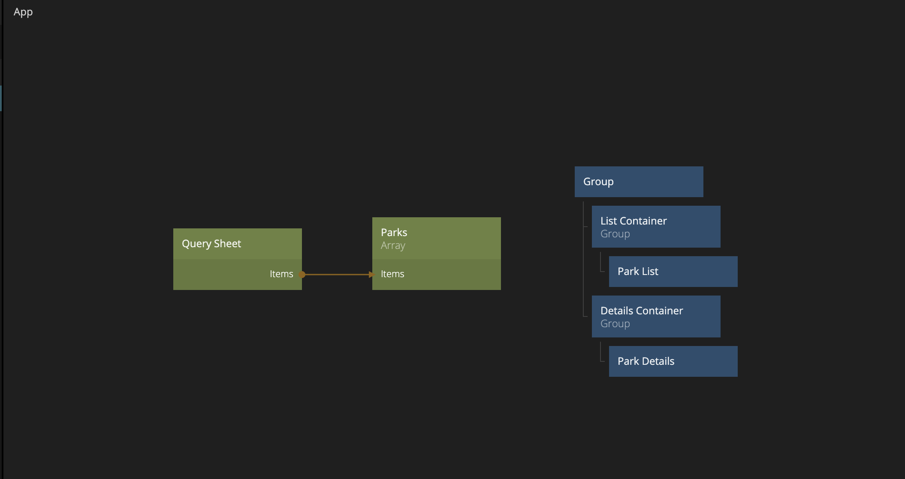

You should also see something like this in the preview window:

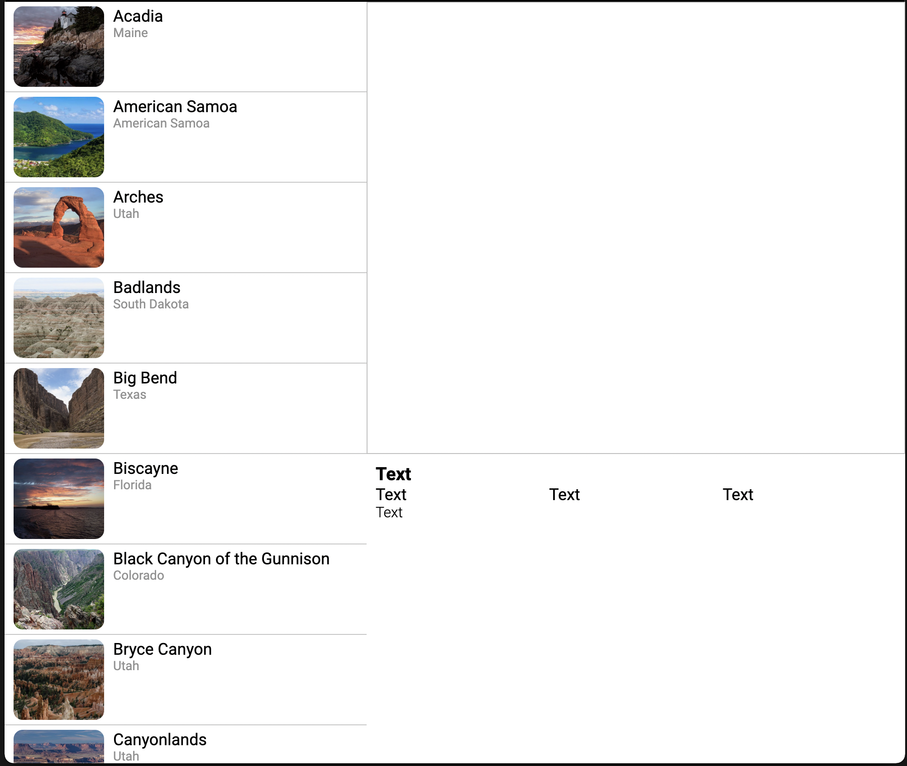

This is great, but it would be even nicer with some actual content!

## Using the Sheet Row node to get the correct details data

To get the correct content in the Park Details component, we will again use a [Sheet Row](/modules/gsheets/node-docs/sheet-row/) node, so let's add that like this.