# Using Markers in the Mapbox Module

## What you will learn in this guide
This guide will teach you how to add and remove markers to your Mapboc Map in Noodl.

## Overview
This guide will walk you through the following steps

* Adding markers to the map
* Capturing when the user clicks a marker
* Removing markers from the map

The guide will build on the two previous Mapbox guides, [Setting up Mapbox module]() and [Interacting with the Mapbox Module](). It's recommended that you read those guides first, if you haven't already.

The guide will build upon the example from the previous guides. You can import the result from the previous guide by clicking the import button below. Don't forget to set the correct Access Token that you got from your Mapbox account.

<div class="ndl-image-with-background l">
    </img>
<button class="ndl-import-button" onClick='importIntoNoodl("/2.4/modules/mapbox/guides/interacting/interacting.zip",{name:"Mapbox Interactions",thumb:"/2.4/modules/mapbox/guides/interacting/screen-2.png"})'></button>
</div>

## Markers
Markers are used to mark points in the map. They can be anywhere on the map and have can have different colors.

<div class="ndl-image-with-background s">

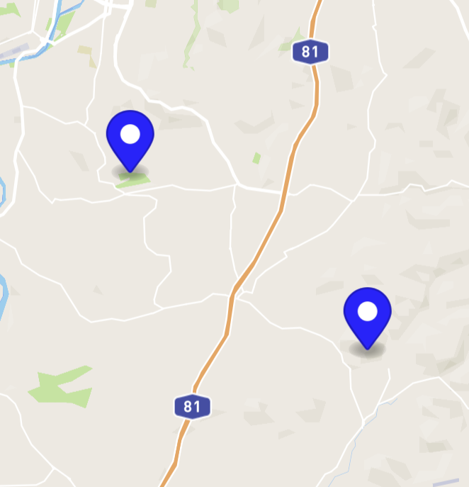

</div>

Markers are fed to the Mapbox module through a [Array](/nodes/data/array/array/). Each [Object](/nodes/data/object/object/) in the **Array** should be of the format:
```
{
	"Lat":<the latitude>,
	"Lon":<the longitude>,
	"Color":<the color, e.g, "White" or as hex-string "#ffffff">
}
```
Let's change our App so you add a marker whenever you click on the map.
First we add an **Array** node. Give it the **id** `Map Markers`.

<div class="ndl-image-with-background">

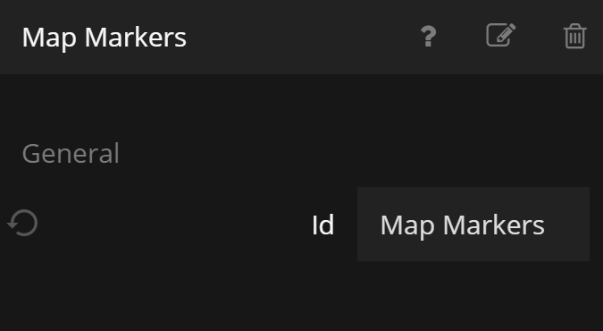

</div>

This will feed the markers to the **Mapbox** node, so connect its output **Items** to the **Markers** input on the **Mapbox** node.

<div class="ndl-image-with-background l">

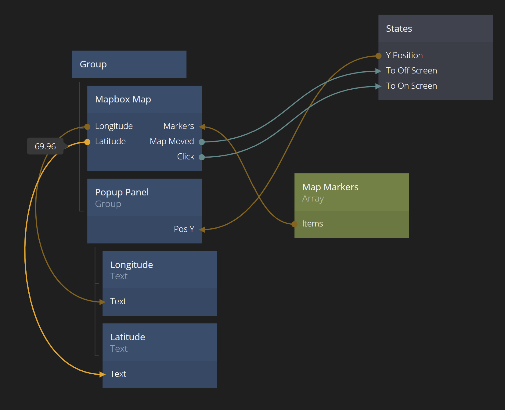

</div>

Now we need to add new **Objects** to the **Array** whenever the user clicks on the map. Add a [Create New Object](/nodes/data/object/create-new-object/) node and make sure you can set the three properties `Lon` (Number), `Lat` (Number) and `Color` (String) when you create it.

<div class="ndl-image-with-background l">

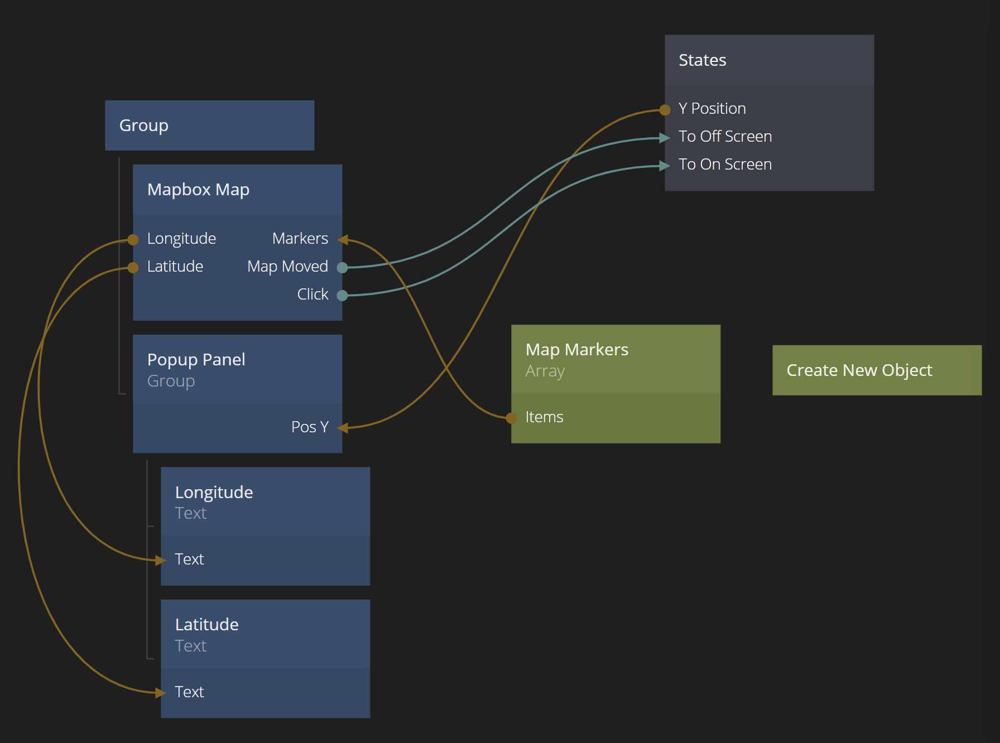

</div>

<div class="ndl-image-with-background s">

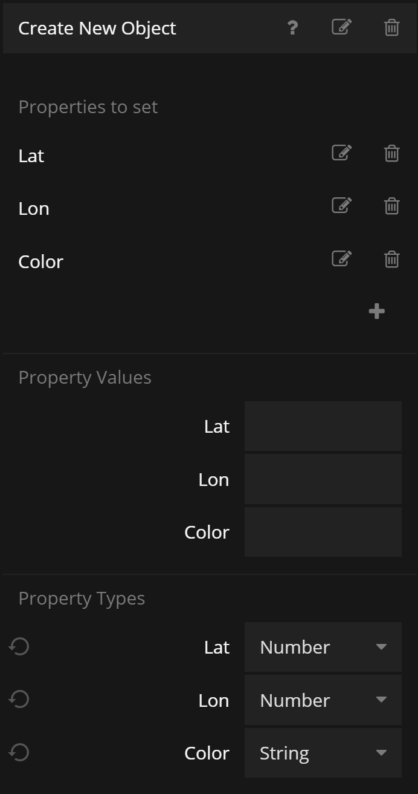

</div>

We want to set the `Lat` and `Lon` to the position the user clicks, so connect the `Latitude` and `Longitude` outputs from the Mapbox to the them. We can hard code the color to `Black` for now, so just enter `Black` directly in the properties panel of the **Create New Object** node. Then we connect the **Click** event from the **Mapbox Map** node to the **Do** signal of the **Create New Object** node.

<div class="ndl-image-with-background l">

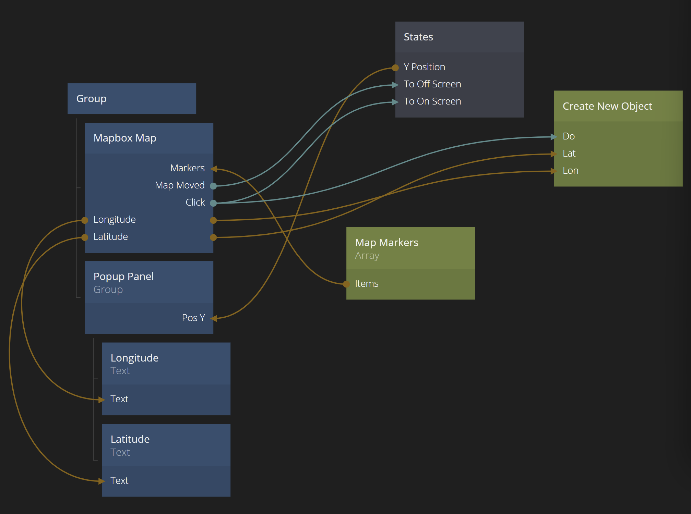

</div>

The newly created **Object** need to be added to the **Array** that holds the markers. So by adding a [Insert Object Into Array](/nodes/data/array/insert-into-array/) node, connecting the **Done** signal from the **Create new Object Node** to **Do** and also connecting the **Id** to **Object Id** we are almost done. We just need to make sure the insert happens in the correct **Array**. So either hardcode the **Array Id** to `Map Markers`, or connect the **Id** of the **Array** to the **Array Id** of the **Insert Object Into Array** node.

<div class="ndl-image-with-background l">

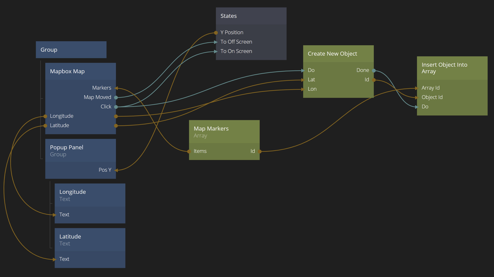

</div>

If everything was done correctly, you should now be able to place black markers on the map.

<div class="ndl-image-with-background">

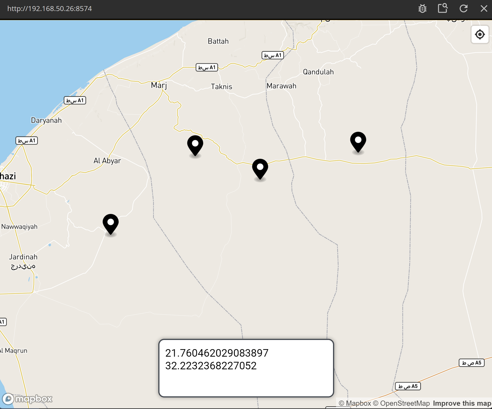

</div>

## Capturing when the user clicks a marker

Next step is to be able to do something when the user clicks a marker. So we need to differentiate between clicking on the map and clicking on a marker. Conveniently there is an additional outgoing signal on the **Mapbox Map** node called **Marker Click**. Another signal will be important to, the **Marker Id** output that will contain the **Id** of the **Object** in the marker **Array** that represent the clicked marker.

So let's change up the logic slightly, so the panel either shows the marker that was clicked, or the newly created marker if the user didn't click the marker.

Using [Variable](/nodes/data/variable/variable/) and [Set Variable](/nodes/data/variable/set-variable/) node and some logic around that, we make sure a **Variable** holds the current marker. See the [guide](/guides/working-with-data/local-data/using-variables/) on using **Variables** if you want to know more about how to use them.
Also, the **Marker Click** signal also makes the panel visible. The full node design can be seen below.

<div class="ndl-image-with-background l">

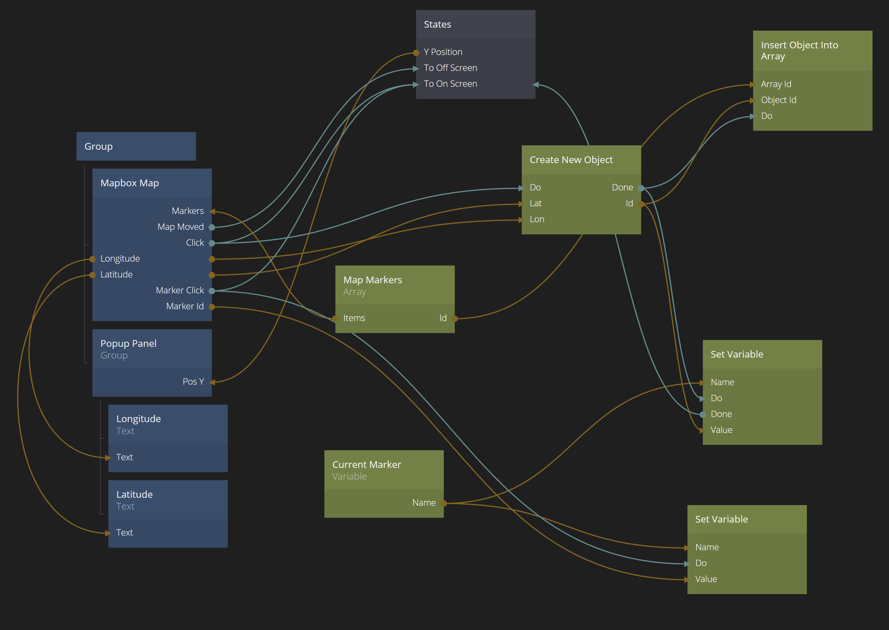

</div>

Finally let's update the panel logic. We want to make sure the latitude/longitude values comes from the marker and not from where you clicked on the map. It won't make a difference now, but we might want to capture more information in the marker we want to show in the panel, so it's a better design.

The `Current Marker` Variable hold the **Id** of the current marker, so just connect it to an **Object** and take out the `Lon` and `Lat` properties from it. The updated design is shown below.  

<div class="ndl-image-with-background l">

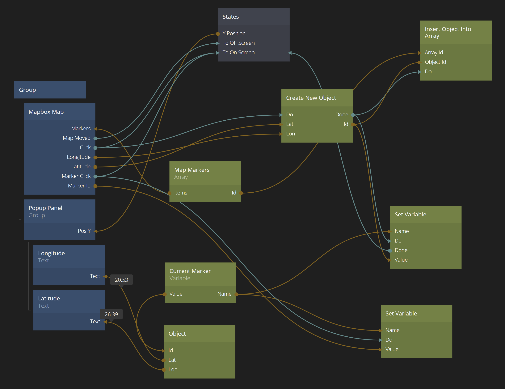

</div>

## Removing Markers

Finally we want to be able to remove markers. It's very easy, just remove them from the Marker **Array**.
So let's add a [Button](/nodes/ui-elements/button/) to the panel. Remove its label and instead add an icon that represents "delete". Also make it smaller by adapting its padding and size. Finally make it red so it's clear it's a destructive action.

<div class="ndl-image-with-background s">

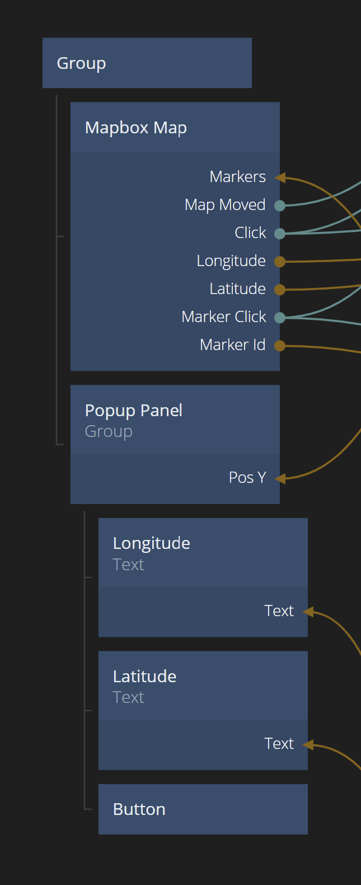

</div>

<div class="ndl-image-with-background s">

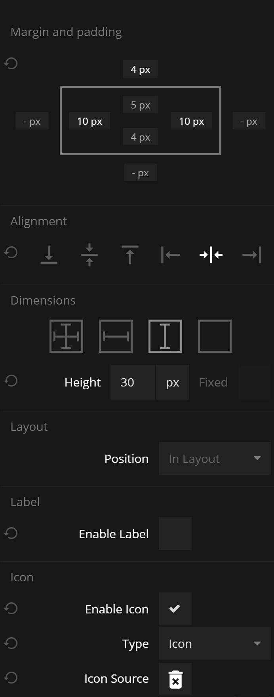

</div>

<div class="ndl-image-with-background">

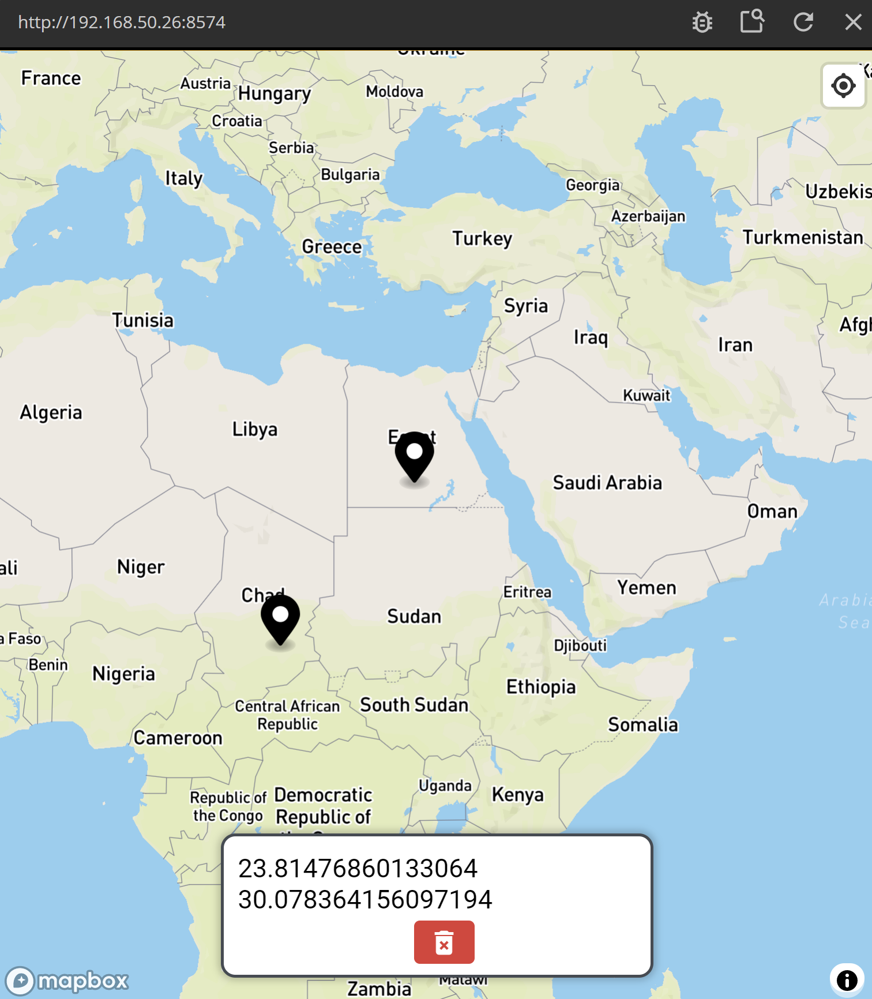

</div>

Finally we connect the functionality for the button. We add a [Remove Object From Array](/nodes/data/array/remove-from-array/) node and make sure the **Object Id** is what's stored in the `Current Marker` **Variable** and the **Array Id** comes the same **Id** as the `Map Markers` **Array**.

The **Click** signal from the **Button** is connected to **Do** on the **Remove Object From Array** node. Finally we also close the panel when the delete is **Done**.

This is what the final node construct looks like. If you want to import the final project click the "Import" button:

<div class="ndl-image-with-background l">
    </img>
<button class="ndl-import-button" onClick='importIntoNoodl("/2.4/modules/mapbox/guides/using-markers/markers.zip",{name:"Mapbox Interactions",thumb:"/2.4/modules/mapbox/guides/using-markers/screen-3.png"})'></button>
</div>
