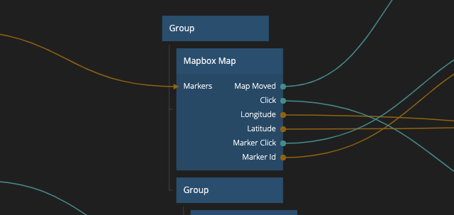
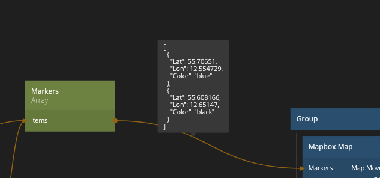

<##head##>

# Mapbox Map

This node adds a map to the visual tree, using [Mapbox](https://www.mapbox.com/). The map can be both interactive and static.

Markers can be placed on the map by sending an array of marker objects containing `Lat`, `Long` and `Color` to the Markers input. `Color` can be specified as a string, (e.g. "White") or as a hex string (e.g. "#ffffff").

<##head##>

## Inputs

| Data                                      | Description                                                                                                                |
| ----------------------------------------- | -------------------------------------------------------------------------------------------------------------------------- |
| Longitude   | Sets the current active longitude.                                                                                         |
| Latitude    | Sets the current active latitude.                                                                                          |
| Zoom        | Sets the zoom level of the map.                                                                                            |
| Markers     | An array of markers on the map. Every marker is defined as an object containing the properties `Lat`, `Lon `, and `Color`. |
| Type     | Specifies the Marker type. Can be either `Default` or `Image` |
| Source     | Specifies the source of the Marker image. Only available if the Marker is om `Image` type. |
| Width     | Specifies the width of the Marker image (in pixels). Only available if the Marker is om `Image` type. |
| Height     | Specifies the height of the Marker image (in pixels). Only available if the Marker is om `Image` type. |
| Anchor     | Specifies the the anchor point of the Marker image in relation to the location on the map. Only available if the Marker is om `Image` type. |
| Interactive | Sets if users can interact with the map or not.                                                                            |
| Style       | A path to a [Mapbox Style](https://docs.mapbox.com/api/maps/styles/).                                                      |

| Signal                                         | Description                                                                                |
| ---------------------------------------------- | ------------------------------------------------------------------------------------------ |
| Center on user | Send a signal to this port to center the map to the current active latitude and longitude. |

## Outputs

| Data                                            | Description                                                                                      |
| ----------------------------------------------- | ------------------------------------------------------------------------------------------------ |
| (Coordinates) Longitude         | The current active longitude.                                                                    |
| (Coordinates) Latitude          | The current active latitude.                                                                     |
| Zoom              | The current zoom level of the map.                                                               |
| (Map Clicked) Longitude         | The longitude that where the user clicked last. To be used with the Click signal.                                                                    |
| (Map Clicked) Latitude          | The latitude that where the user clicked last. o be used with the Click signal.                                                                     |
| Marker Id         | If you have clicked a marker on the map, this port will send the `Id` of the clicked marker.     |
| Width             | The with of the map container.                                                                   |
| Height            | The height of the map container.                                                                 |
| Screen Position X | The amount of pixels between the left side of the window and the left side of the map container. |
| Screen Position Y | The amount of pixels between the top of the window and the top side of the map container.        |

| Signal                                       | Description                                                                               |
| -------------------------------------------- | ----------------------------------------------------------------------------------------- |
| Click        | Sends a signal when the map is clicked.                                                   |
| Marker Click | Sends a signal when a marker is cliked.                                                   |
| Map Loaded   | Sends a signal when the map has finished loading, after it has been mounted in the app.   |
| Map Moved    | Sends a signal after the map in view has been moved.                                      |
| Did Mount    | Sends a signal when the map has been rendered in the app, before the map has been loaded. |
| Will Unmount | Sends a signal before the map will be removed from the visual tree.                       |
