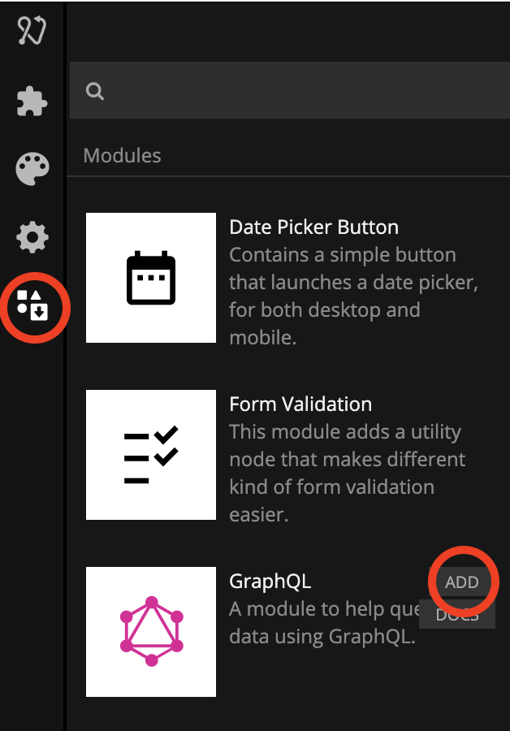

# Modules

The base nodes bundled with Noodl feature all functionality needed to build most apps, but sometimes an app requires a little more. One very powerful feature of Noodl are **modules**. These are small, external node libraries with additional functionality that can be imported into your project. Modules can be downloaded from the public **Noodl Module Repository**, or custom built using the Noodl SDK.

## Build your own private modules

One of the most powerful features of Noodl is its extendability. Using the Noodl SDK you can build your own nodes as if they where official Noodl nodes. See the [extending](/extending/README) guide for more details on private modules.

?>**Sharing is caring** Really happy with your private module? Do you think it can make someone else happy as well? Feel free to reach out on our [Discord](https://discord.gg/23xU2hYrSJ) or [Forum](https://forum.noodl.net/) and we'll make sure to look for an official place in the Noodl Module Repository for it!

## Importing modules

To add a module you will first open the **Library Panel**. Here you can find modues from the Noodl Module Repository and your private modules. You can also import from your local and cloud projects.

When you want to add a module to your workspace you simply click the **Add** button. This will download and add the Modules included components or nodes to your projects Node Picker. To learn how to use a module make sure you check out the documentation by clicking the **Docs** button.

## Noodl Module Repository

Below you will find a list of the modules in the Noodl Module Repository:

<table class="modules-table">
    <tr>
        <td></img></td>
        <td><a href="#/modules/datepicker-button/">Date Picker Button</a> This module contains a simple button that launches a date picker, for both desktop and mobile.</td>
    </tr>
    <tr>
        <td></img></td>
        <td><a href="#/modules/validation/">Form Validation</a> This module adds a utility node that makes different kind of form validation easier.</td>
    </tr>
    <tr>
        <td></img></td>
        <td><a href="#/modules/graphql/">GraphQL</a> A module to help quering data using GraphQL.</td>
    </tr>
    <tr>
        <td></td>
        <td><a href="#/modules/custom-html/">Custom HTML</a> Write your own HTML and pass values to it with template strings. Useful for embeds.</td>
    </tr>
    <tr>
        <td></img></td>
        <td><a href="#/modules/i18next/">i18next Translation</a> Module for using i18next in Noodl.</td>
    </tr>
    <tr>
        <td></img></td>
        <td><a href="#/modules/lottie/">Lottie</a> This module adds support for Lottie animations in Noodl.</td>
    </tr>
    <tr>
        <td></img></td>
        <td><a href="#/modules/markdown/">Markdown</a> A module that enables you to use Markdown in Noodl and style it with CSS.</td>
    </tr>
    <tr>
        <td></img></td>
        <td><a href="#/modules/mqtt/">MQTT Module</a> This module contains nodes for sending and receiving messages over MQTT in web apps.</td>
    </tr>
    <tr>
        <td></img></td>
        <td><a href="#/modules/webcamera/">Web Camera</a> This module adds support for accessing the camera in web apps.</td>
    </tr>
    <!--<tr>
        <td></img></td>
        <td><a href="#/modules/mapbox/">Mapbox</a> This module adds support for maps and location technology through Mapbox.</td>
    </tr>  -->
    <!--<tr>
        <td></img></td>
        <td><a href="#/modules/chartjs/">Chart.js</a> A simple and flexible way to do charts and visualizations in Noodl.</td>
    </tr>  -->

</table>
