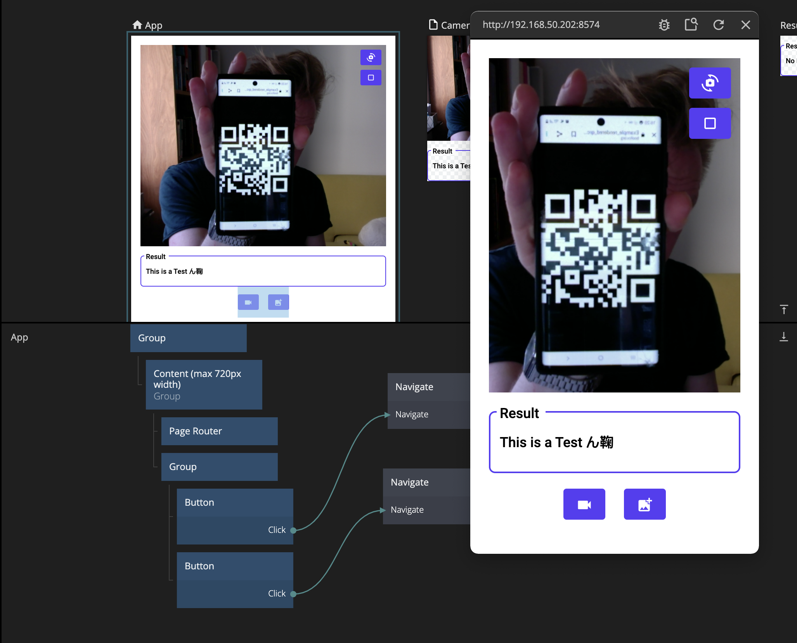

# QR code scanner
This module is a wrapper of the [QR Scanner](https://github.com/nimiq/qr-scanner#readme) library. I contains two nodes, the [Camera QR Scanner]() and the [Image QR Scanner]() nodes. With this module you can build apps that can scan QR codes either using the camera or by uploading an image.

