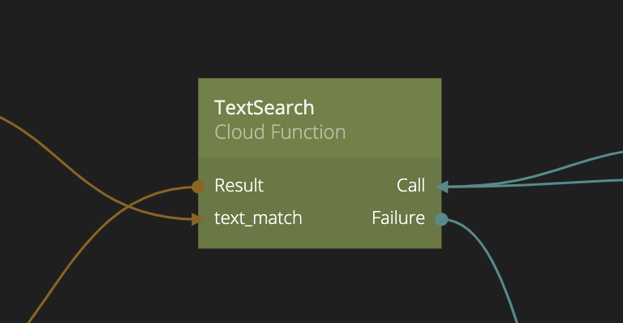
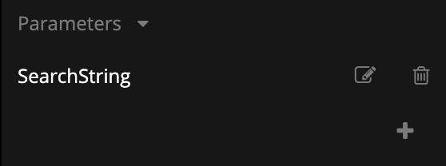
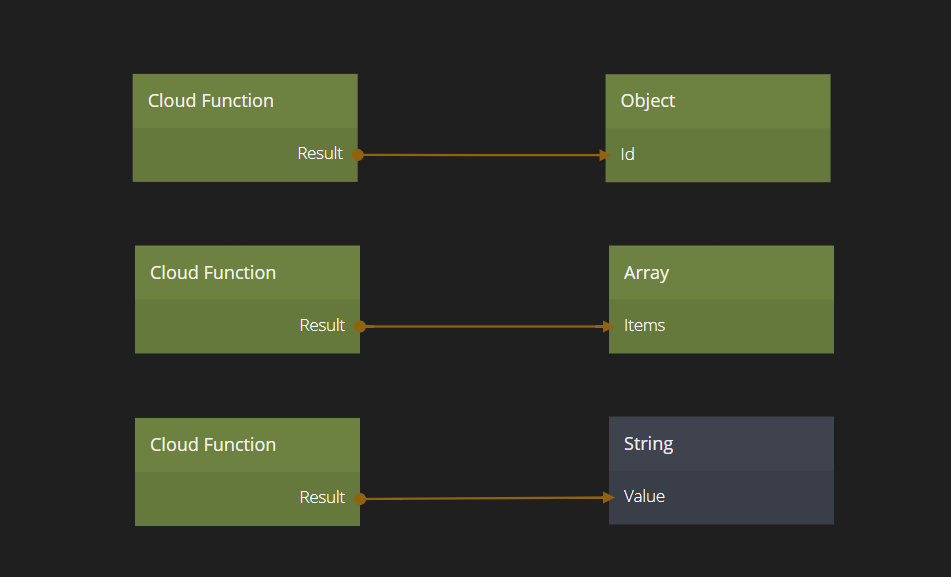

<##head##>

# Cloud Function

This node is used to make calls to a backend cloud functions. There are several ways to add backend functions to your Noodl application. You can use no-code tools such as [Zapier](/guides/zapier), or you can add functions in code using an external [Parse](https://parseplatform.org) backend.

You need to specify the name of the cloud function you want to call. This is done via the **Function Name** property.

You can also provide parameters that you want to be passed to the cloud function by adding them using the **Parameters** property. Once a parameter is added the corresponding input is available on the node. You provide the input values via regular Noodl connections.

The cloud function can return a value, an object or an array when finished. The return value will be available on the **Result** output. The result value will be converted to a Noodl type, for example an [Object](/nodes/data/object/object/) or an [Array](/nodes/data/array/array/) containing **Objects**.
The only exception is if the returned array is an array of JavaScript primitives (strings, numbers, booleans), i.e. _not_ objects. Then Noodl cannot convert the array to a Noodl **Array** with **Objects**. Instead the returned array will be a JavaScript array with primitives that need to be handed in JavaScript by a [Function](/nodes/javascript/function.md) or [Script](/nodes/javascript/script.md) node.

<##head##>

## Inputs

| Data                                            | Description                                                                                                                                      |
| ----------------------------------------------- | ------------------------------------------------------------------------------------------------------------------------------------------------ |
| Function Name     | <##input:functionName##>The name of the cloud function to call.<##input##>                                                                       |
| Custom Parameters | <##input:pm-\*##>A parameter that will be passed to the function. Any parameters you add will become available as inputs on the node.<##input##> |

| Signal                               | Description                                                                                 |
| ------------------------------------ | ------------------------------------------------------------------------------------------- |
| Call | <##input:call##>Send a signal on this input to issue the request to the backend.<##input##> |

## Outputs

| Data                                 | Description                                                                                                                                                                                                                                                                                                                |
| ------------------------------------ | -------------------------------------------------------------------------------------------------------------------------------------------------------------------------------------------------------------------------------------------------------------------------------------------------------------------------- |
| Result | <##output:result##>This output will contain the result that the **Cloud Function** returns upon completion. Depending on the type returned from the function this will either be a [Noodl.Object](/javascript-api/noodl-object.md), [Noodl.Array](/javascript-api/noodl-array.md) or a simple javascript type.<##output##> |

| Signal                                  | Description                                                                                              |
| --------------------------------------- | -------------------------------------------------------------------------------------------------------- |
| Success | <##output:success##>This is sent if the function returns a success code and a result object.<##output##> |
| Failure | <##output:failure##>This is sent if the function returns a fail code.<##output##>                        |
