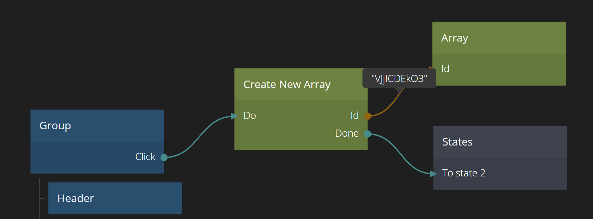

<##head##>

# Create New Array

Creates a new Array. The outgoing property _Id_ is the id of the newly created array. This can for example be connected to an [Array node](nodes/data/array/array/) or [Insert Object Into Array Node](nodes/data/array/insert-into-array/).

<##head##>

## Inputs

| Data                                | Description                                                                                                                                                                                                                         |
| ----------------------------------- | ----------------------------------------------------------------------------------------------------------------------------------------------------------------------------------------------------------------------------------- |
| Items | <##input:items##>An array containing initial items of the new array. It will be read when the _Do_ signal is triggered. In other words, the new Array will be a copy of the provided Array, containing the same Objects.<##input##> |

| Signal                             | Description                                                                                                                                                                                                                 |
| ---------------------------------- | --------------------------------------------------------------------------------------------------------------------------------------------------------------------------------------------------------------------------- |
| Do | <##input:do##>Sending a signal to this input creates the new Array. The _Id_ of the newly created array will be set on the _Id_ output. Each triggering will create a new Array, hence changing the _Id_ output.<##input##> |

## Outputs

| Data                             | Description                                                                                          |
| -------------------------------- | ---------------------------------------------------------------------------------------------------- |
| Id | <##output:id##>The Id of the newly created Array. You use this Id to refer to the Array.<##output##> |

| Signal                               | Description                                                                                |
| ------------------------------------ | ------------------------------------------------------------------------------------------ |
| Done | <##output:done##>This signal will be sent when the new Array has been created.<##output##> |
