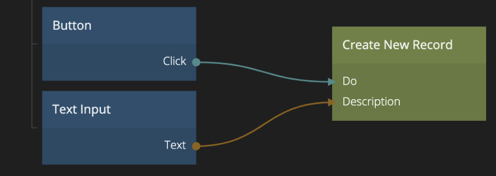

<##head##>

# Create New Record

This node is used to create a new record of a given class. You specify the class of record to be created in the Property Panel. Sending a signal to Do will perform the action.

You can also provide values for the properties of the record either via connections or by typing the values in the property panel.

<##head##>

## Inputs

| Data                                          | Description                                                                                                                                                                                                                                                                                                                                                                                   |
| --------------------------------------------- | --------------------------------------------------------------------------------------------------------------------------------------------------------------------------------------------------------------------------------------------------------------------------------------------------------------------------------------------------------------------------------------------- |
| Class           | Choose a class for the record that you want to create.                                                                                                                                                                                                                                                                                                                                        |
| Property Inputs | When the class of the record to be created is choosen, all properties of that class will be available as inputs. When the **Do** signal is received a new record will be created with the values of the properties either specified in the property panel or via connections. <##input:prop-\*##>The value of these inputs will become the properties of the newly created record.<##input##> |

| Signal                             | Description                                                                  |
| ---------------------------------- | ---------------------------------------------------------------------------- |
| Do | <##input:do##>Send a signal on this input to create a new record.<##input##> |

## Outputs

| Data                                | Description                                                                                                     |
| ----------------------------------- | --------------------------------------------------------------------------------------------------------------- |
| Id    | <##output:id##>The **Id** of the new record that was created if the action was successful.<##output##>          |
| Error | <##output:error##>The specific error message in case something went wrong when creating the record.<##output##> |

| Signal                                  | Description                                                                                                                                                                |
| --------------------------------------- | -------------------------------------------------------------------------------------------------------------------------------------------------------------------------- |
| Success | <##output:success##>A signal is sent here when the new record have been created successfully.<##output##>                                                                  |
| Failure | <##output:failure##>A signal is sent on this output if something went wrong when creating the record.<##output##> You can find the specific error in the **Error** output. |
