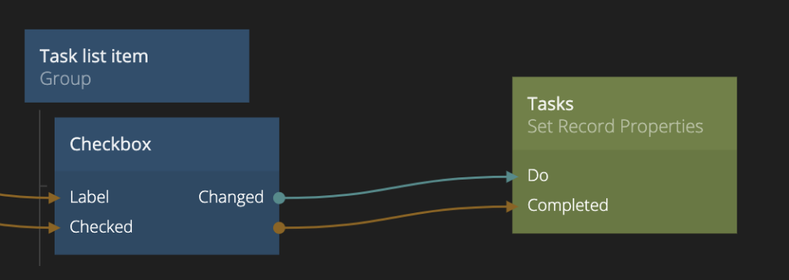

<##head##>

# Set Record Properties

This action node will set property values of a record.

You need specify the class of the record in the property panel. Then you can either specify the values of the properties to set in the property panel or by providing them as an input connection.

Send a signal to Do to perform the action.
<##head##>

## Inputs

| Data                                          | Description                                                                                                                                                                                                                                                                                          |
| --------------------------------------------- | ---------------------------------------------------------------------------------------------------------------------------------------------------------------------------------------------------------------------------------------------------------------------------------------------------- |
| Class           | The class of record for this node. Choosing the class will determine which property inputs that become available on the node.                                                                                                                                                                        |
| Store to        | <##input:store to##>Specifies if this node should store both to the cloud and locally, or only locally.<##input##>                                                                                                                                                                                   |
| Id              | <##input:id##>Specify the **Id** of the record that you want to set the properties on.<##input##> This input is only valid if **Id Source** is set to **Specify explicitly**.                                                                                                                        |
| Property Inputs | <##input:prop-\*##>The value to set this property to when the action is triggered.<##input##> For each property in the specified class there will be an input of the correct type. You can provide the values for the inputs either through connections or by specifying them in the property panel. |

[filename](../id-source.md ':include')

| Signal                             | Description                                                                                                |
| ---------------------------------- | ---------------------------------------------------------------------------------------------------------- |
| Do | <##input:do##>When a signal is received on this input the properties will be set on the record.<##input##> |

[filename](../acl.md ':include')

## Outputs

| Data                                | Description                                                                                                     |
| ----------------------------------- | --------------------------------------------------------------------------------------------------------------- |
| Id    | <##output:id##>The **Id** of the record where the properties will be updated by this node.<##output##>          |
| Error | <##output:error##>The specific error message in case something went wrong when updating the record.<##output##> |

| Signal                                  | Description                                                                                                                                                                |
| --------------------------------------- | -------------------------------------------------------------------------------------------------------------------------------------------------------------------------- |
| Success | <##output:success##>A signal is sent here when the record have been updated successfully.<##output##>                                                                      |
| Failure | <##output:failure##>A signal is sent on this output if something went wrong when updating the record.<##output##> You can find the specific error in the **Error** output. |
