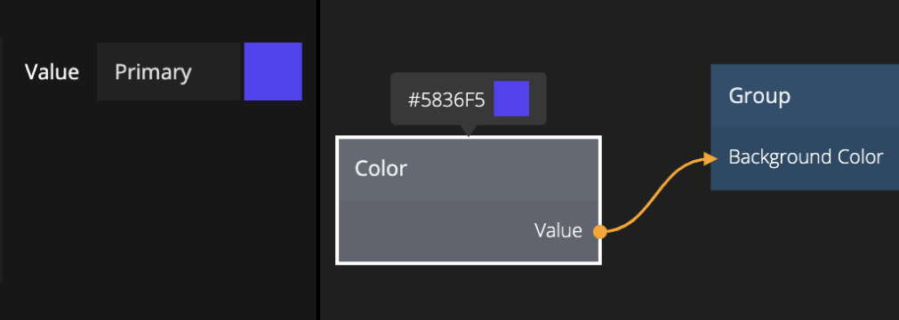

<##head##>

# Color

This node holds a color value.

The color value can either be static or dynamic using the Value and Set inputs.

<##head##>

## Inputs

| Data                                | Description                                                                                                                                                                     |
| ----------------------------------- | ------------------------------------------------------------------------------------------------------------------------------------------------------------------------------- |
| Value | The value to store in the node. The output value will equal this value, unless _Set_ is connected, then the value will be updated when a signal is received at the _Set_ input. |

| Signal                              | Description                                                            |
| ----------------------------------- | ---------------------------------------------------------------------- |
| Set | This is used to only update the output when a signal is sent to _Set_. |

## Outputs

| Data                                | Description                  |
| ----------------------------------- | ---------------------------- |
| Value | The color stored in the node |

| Signal                                 | Description                                                                                        |
| -------------------------------------- | -------------------------------------------------------------------------------------------------- |
| Stored | This port sends a signal when the value is updated as a result of the _Set_ signal being received. |
