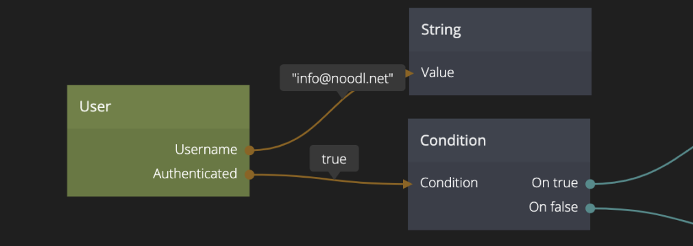
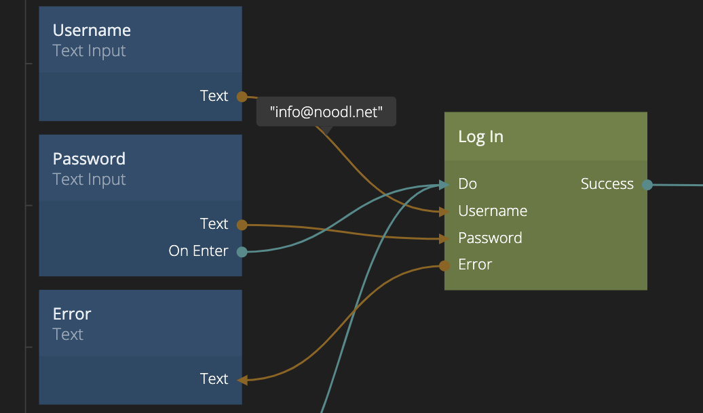

<##head##>

# User

This node provides information about the current user session, if the web app has a logged in user.

The User node only works if the user is created in the project’s Noodl Cloud Service, and is logged in via the Log In node.

<##head##>

## Inputs

| Signal                                | Description                                                                                                                                                                                             |
| ------------------------------------- | ------------------------------------------------------------------------------------------------------------------------------------------------------------------------------------------------------- |
| Fetch | <##input:fetch##>Send a signal to this input to fetch the user properties for the current logged in user from the Noodl Cloud Services. There must be a valid user session for this to work.<##input##> |

## Outputs

| Data                                                 | Description                                                                                                                                                                               |
| ---------------------------------------------------- | ----------------------------------------------------------------------------------------------------------------------------------------------------------------------------------------- |
| Id                     | <##output:id##>The **Id** of the User record for the current logged in user.<##output##>                                                                                                  |
| Username               | <##output:username##>The **Username** of the current logged in user.<##output##>                                                                                                          |
| Email                  | <##output:email##>The **Email** of the current logged in user, if the user has an email stored.<##output##>                                                                               |
| Authenticated          | <##output:authenticated##>This output will be true if a valid user session exists in the browser, i.e. there is a logged in user.<##output##>                                             |
| Error                  | <##output:error##>If a **Fetch** action failed to retrieve the user information from the Noodl Cloud Services this output will contain the error message.<##output##>                     |
| Your custom properties | <##output:prop-\*##>The value of extra properties of the **User** class specified in the Noodl Cloud Services.<##output##> The node will contain the latest value of all user properties. |

| Signal                                         | Description                                                                                                                                                                                                                           |
| ---------------------------------------------- | ------------------------------------------------------------------------------------------------------------------------------------------------------------------------------------------------------------------------------------- |
| Fetched        | <##output:fetched##>This signal is triggered after a **Fetch** has been successfully performed. That is the **Fetch** action is triggered by a signal and the user data is return from the Noodl Cloud Services.<##output##>          |
| Changed        | <##output:changed##>This signal is triggered when the User is changed locally by a **Set User Properties** node or a **Fetch** action of a **User** node.<##output##>                                                                 |
| Failure        | <##output:failure##>This signal is triggered when a **Fetch** action failed to retrieve the latest user data from the Noodl Cloud Services. This could be due to an invalid session.<##output##>                                      |
| Logged In      | <##output:logged in##>This signal is triggered when a user has been successfully logged in.<##output##>                                                                                                                               |
| Logged Out     | <##output:logged out##>This signal is triggered when a user has been successfully logged out.<##output##>                                                                                                                             |
| Session Lost   | <##output:session lost##>This signal is triggered when the current user session becomes invalid, e.g. if it has timed out.<##output##>                                                                                                |
| Changed events | <##output:changed-\*##>This signal will be triggered when the property is changed using the **Set User Property** node or when the latest user data is retrieved from the Noodl Cloud Services with the **Fetch** action.<##output##> |
