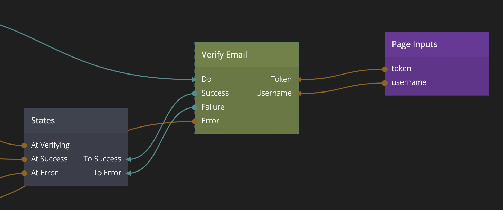

<##head##>

# Verify Email

This node is used to verify the email of a user. When this action is performed successfully the emailVerified property of the User will be set to true. You can use this property to enable or disable certain parts of your application. This node will need two things to successfully verify the user email, the Username and a secret Token that should be delivered to your user when they sign up or via the [Send Email Verification](/nodes/data/user/send-email-verification/) action node.

Generally your application should have a specific **email verification page** that is linked to from the verification email, the username and token should be provided as query parameters to the page. Once you have hooked that up you need to trigger the Do action, preferably when the page loads via the Did Mount signal.

<##head##>

## Inputs

| Signal                             | Description                                                                                                                  |
| ---------------------------------- | ---------------------------------------------------------------------------------------------------------------------------- |
| Do | <##input:do##>Send a signal to this action to attempt to verify the email for the provided username and token.<##input##> |

| Data                                | Description                                                                                     |
| ----------------------------------- | ----------------------------------------------------------------------------------------------- |
| Username | <##input:username##>The username that this action will attempt to verify the email for.<##input##> |
| Token | <##input:token##>The secret token needed to verify the email.<##input##> |

## Outputs

| Signal                                  | Description                                                                                                                                                                   |
| --------------------------------------- | ----------------------------------------------------------------------------------------------------------------------------------------------------------------------------- |
| Success | <##output:success##>The email was successfully verified.<##output##>                                                                                     |
| Failure | <##output:failure##>This event will be triggered if something when wrong when trying to verify the email. The error message can be found in the **Error** output.<##output##> |

| Data                                | Description                                                                                     |
| ----------------------------------- | ----------------------------------------------------------------------------------------------- |
| Error | <##output:error##>This output will contain the error message if the action failed.<##output##> |