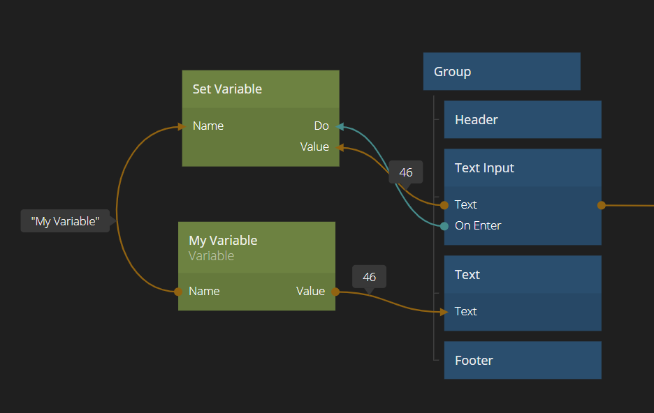

<##head##>

# Set Variable

This node sets the **Value** of a [Variable](/nodes/data/variable/variable/). You provide the new value on the **Value** input and trigger the Do action.

<##head##>

## Inputs

| Data                                | Description                                                                                                                                 |
| ----------------------------------- | ------------------------------------------------------------------------------------------------------------------------------------------- |
| Name  | <##input:name##>The name of the **Variable** to set. Note: All **Variable** nodes with the same name will share the same data.<##input##>   |
| Value | <##input:value##>The value that you want the **Variable** to get when you trigger the Do action.<##input##> |

| Signal                             | Description                                                                                                     |
| ---------------------------------- | --------------------------------------------------------------------------------------------------------------- |
| Do | <##input:do##>Updates the value of the **Variable** to what is currently set on the input **Value**.<##input##> |

## Outputs

| Signal                               | Description                                                                               |
| ------------------------------------ | ----------------------------------------------------------------------------------------- |
| Done | <##output:done##>This event is triggered when the **Variable** have been set.<##output##> |
