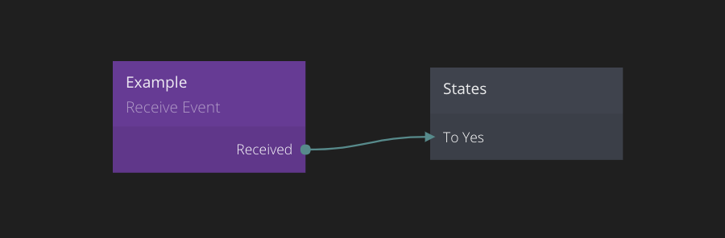

# RECEIVE EVENT

This node is used to receive events triggered by an [Send Event][0] node. To learn more about **Events** check out the [Events guide](/guides/events.md).

## Inputs

**Enabled**  
This port is used to disable/enable this node. If disabled the receiver node will not
be activated when the corresponding [Send Event][0] node is triggered.

**Channel**  
Each **Receive Event** node must listen to a specific channel. This means that when a [Send Event][0]
node of that channel is triggered all **Receive Event** nodes with the same channel will be triggered as well (depending on the propagation, please review the [Events guide](/guides/events.md) for more details).

## Outputs

The **Receive Event** node will automatically get outputs from all [Send Event][0] nodes connected
to the same channel. See the [Send Event][0] documentation for more details on adding ports for sending values with events.

**Received**  
This is a signal port, it is triggered when a signal is triggered in any [Send Event][0] node with
the same channel as this **Receive Event** node.

[0]: /nodes/standard/send-event.md
