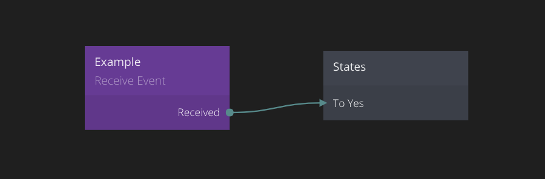

<##head##>

# Receive Event

This node is used to receive a signal triggered by a Send Event node. To learn more about **Events** check out the [Events Guide](/guides/events.md).

The Send Event node lets you specify a channel to broadcast to. All Receive Event nodes set to that channel will be triggered simultaneously.
<##head##>

## Inputs

| Data                                  | Description                                                                                                                                                                                                                                                                                                                                                 |
| ------------------------------------- | ----------------------------------------------------------------------------------------------------------------------------------------------------------------------------------------------------------------------------------------------------------------------------------------------------------------------------------------------------------- |
| Enabled | <##input:enabled##>This port is used to disable/enable this node.<##input##> If disabled the receiver node will not be activated when the corresponding [Send Event][0] node is triggered.                                                                                                                                                                  |
| Consume | <##input:consume##>This property specified if and how the event is consumed when captured by this receive event node.<##input##>                                                                                                                                                                                                                            |
| Channel | <##input:channelName##>Each **Receive Event** node must listen to a specific channel.<##input##> This means that when a [Send Event][0] node of that channel is triggered all **Receive Event** nodes with the same channel will be triggered as well (depending on the propagation, please review the [Events guide](/guides/events.md) for more details). |

## Outputs

| Mixed                                        | Description                                                                                                                                                                                                                    |
| -------------------------------------------- | ------------------------------------------------------------------------------------------------------------------------------------------------------------------------------------------------------------------------------ |
| Custom Outputs | The **Receive Event** node will automatically get outputs from all [Send Event][0] nodes connected to the same channel. See the [Send Event][0] documentation for more details on adding ports for sending values with events. |

| Signal                                   | Description                                                                                                                                                                              |
| ---------------------------------------- | ---------------------------------------------------------------------------------------------------------------------------------------------------------------------------------------- |
| Received | <##output:eventReceived##>This is a signal port, it is triggered when a signal is triggered in any **Send Event** node with the same channel as this **Receive Event** node.<##output##> |
