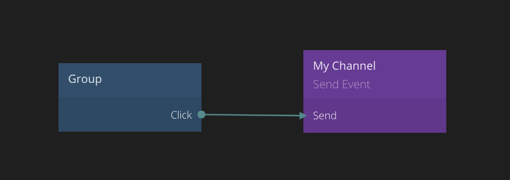

<##head##>

# Send Event

This node sends a signal to another place in your app without having to connect the nodes directly. To learn more about **Events** check out the [Events Guide](/guides/events.md).

The Send Event node lets you specify a channel to broadcast to. When this node is triggered with a Send signal all Receive Event nodes set to that channel will be triggered.
<##head##>

## Inputs

| Mixed             | Description                                                                                                                                                                                                                         |
| ----------------- | ----------------------------------------------------------------------------------------------------------------------------------------------------------------------------------------------------------------------------------- |
| **Custom Inputs** | **Send Event** nodes can have arbitrary input ports that will be passed on to the [Receive Event][0] nodes when the _Send_ signal is triggered. These ports can be added by inspecting the node and clicking the _Add port_ button. |

| Data                                       | Description                                                                                                                                                                                                                                                                                                                                                                                    |
| ------------------------------------------ | ---------------------------------------------------------------------------------------------------------------------------------------------------------------------------------------------------------------------------------------------------------------------------------------------------------------------------------------------------------------------------------------------- |
| Channel Name | The channel name can be any identifier and is used on the [Receive Event][0] nodes to connect a sender and receiver node.  There may be multiple **Send Event** nodes with the same channel. In that case the receiving nodes listening to the channel will get a merged set of ports from all **Send Event** nodes.                                                                   |
| Send To      | <##input:propagation##>Controls what components the event will be sent to.<##input##>  `Global`: Send to all components `Parent`: Send the event up the visual hierarchy to parent components. `Children`: Send the events to all children of this component, and their descendants. `Siblings`: Send the event to all siblings of this component in the visual hierarchy. |

| Signal                                     | Description                                                                                                                                                                                   |
| ------------------------------------------ | --------------------------------------------------------------------------------------------------------------------------------------------------------------------------------------------- |
| Send Event | <##input:sendEvent##>Send a signal to this input to send the event.<##input##> This is a signal port and when triggered the corresponding [Receive Event][0] nodes will be triggered as well. |
