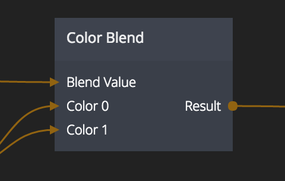

# Color Blend

The color blend node can be used to blend between two or more colors.

## Inputs

**Color 0..N**  
The colors to mix. These ports are numbered as _Color 0_, _Color 1_ etc. When a color is specified a new input will be created for the next color.

**Blend value**  
This specifies how the input colors will be blended. The inputs colors are interpolated linearly so a _Blend Value_ of _0_ will result in the color of the input port _Color 0_ and a value of _1_ will result in _Color 1_.

A value of 0.5 will be a mix of 50% of _Color 0_ and _Color 1_, a number of 1.5 will be a mix between _Color 1_ and _Color 2_, etc. Values below 0 or above the amount of input colors are clamped to the closest color.

## Outputs
**Result**  
The resulting blended color

