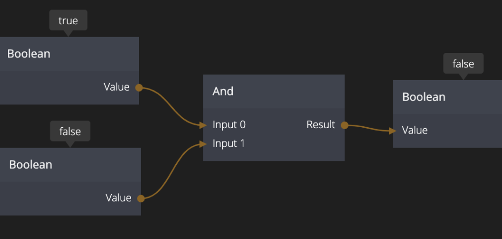

<##head##>
# And

This node performs a logic AND operation on its inputs. If all inputs are true the node will output true. If any input is false the node will output false.

Any number of inputs can be used. When an input is connected a new one will be created automatically.

<##head##>

## Inputs

**Input 0..N**

The inputs are numbered as _Input 0_,_Input 1_ etc. Whenever you connect to an input a new one is
created so you will never run out of inputs.

## Outputs

**Result**

The result of a logic AND operation on all of the inputs. Either `true` or `false`. `True` if all inputs are `true`, `false` if one or more inputs are `false`.

