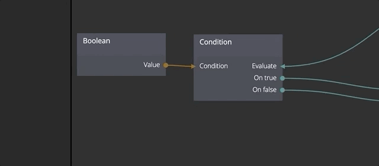

# Condition
Evaluates a condition when triggered and sends a pulse to one of two signal outputs depending on if the condition is true or false.

## Inputs

**Condition**  
A boolean that decides which output signal (*On true* or *On false*) that should be triggered when the *Evaluate* signal is triggered.

**Evaluate**  
Evaluates the *Condition* input and triggers the respective output signal.

## Outputs
**On true**  
Triggered when *Evaluate* is triggered and *Condition* is true.

**On false**  
Triggered when *Evaluate* is triggered and *Condition* is false.

