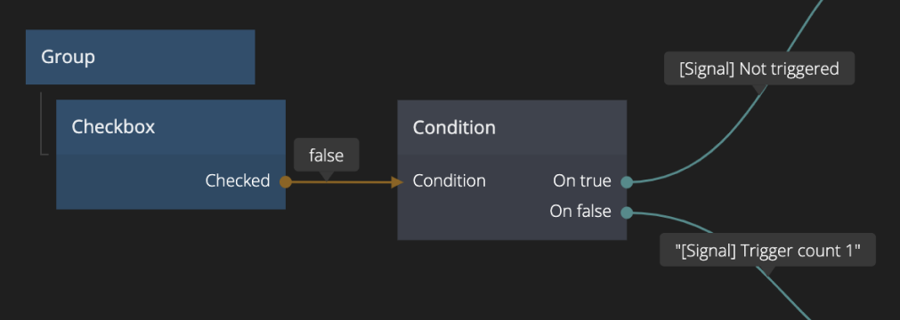

# Condition

Evaluates a condition when triggered and sends a pulse to one of two signal outputs depending on if the condition is true or false.

## Inputs

| Data                                    | Description                                                                                                                            |
| --------------------------------------- | -------------------------------------------------------------------------------------------------------------------------------------- |
| Condition | A boolean that decides which output signal (_On true_ or _On false_) that should be triggered when the _Evaluate_ signal is triggered. |

| Signal                                   | Description                                                                                               |
| ---------------------------------------- | --------------------------------------------------------------------------------------------------------- |
| Evaluate | Sending a signal to this input evaluates the _Condition_ input and triggers the respective output signal. |

## Outputs

| Signal                                  | Description                                                      |
| --------------------------------------- | ---------------------------------------------------------------- |
| On true | Triggered when _Evaluate_ is triggered and _Condition_ is true.  |
|         | Triggered when _Evaluate_ is triggered and _Condition_ is false. |
