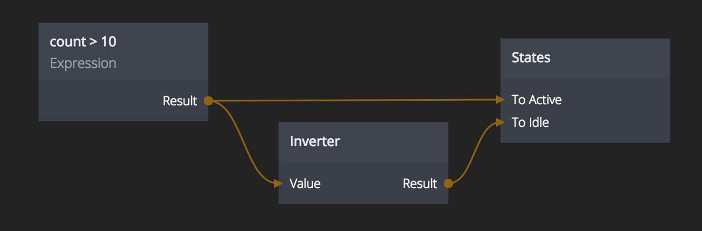

<##head##>

# Inverter

This node changes true values to be false, and false values to be true. It is identical to a logic NOT operation.

The Inverter node runs JavaScript in the background and interprets truthy and falsy values in the same fashion. It is equal to creating an Expression node with the expression `!value`.

<##head##>

## Inputs

**Value**
The value to invert.

## Outputs

**Result**
The result of inverting the input _Value_. This is equal to either _True_ or _False_

## Advanced

The inverter is equal to creating the following expression:
`!value` .
