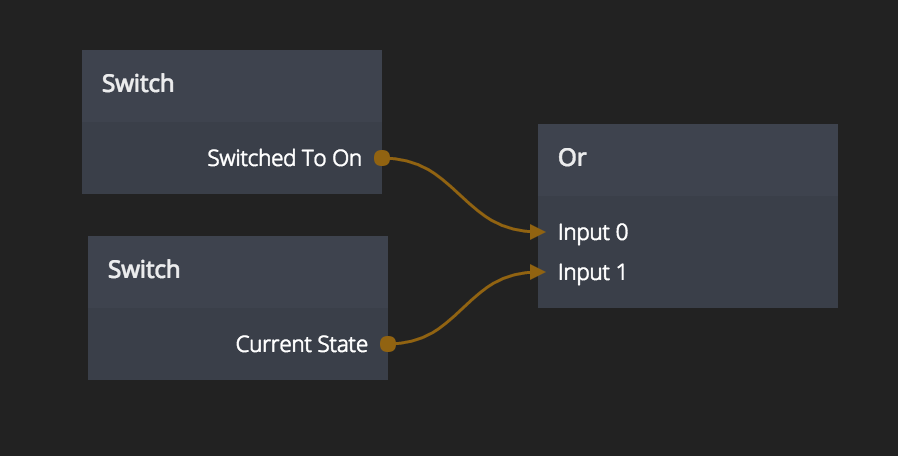

# Or

This node performs a logic OR operation on its inputs. If any input is true the node will output true. If all inputs are false the node will output tfalse.

Any number of inputs can be used. When an input is connected a new one will be created automatically.

## Inputs

**Input 0..N**
The inputs are numbered as Input 0,Input 1 etc. Whenever you connect to an input a new one is created so
you will never run out of inputs.

## Outputs

**Result**
The result of a logic OR operation on all of the inputs. `True` if any one of the inputs is `true`, `false` if all inputs are `false`.

