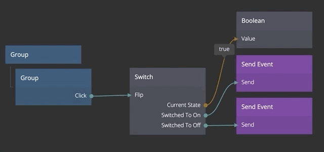

<##head##>

# Switch

This node holds a boolean state. It is either true (on) or false (off).

<##head##>

## Inputs

### Change state

**On**
Sets the state of the **Switch** to _On_

**Off**
Sets the state of the **Switch** to _Off_

**Flip**
Set the **Switch** to the opposite state. If it's _On_ flip will set it to _Off_ and vice versa

### Start State

**Start State**
The starting state of the **Switch**. If the _Start State_ is set to _On_ then the _Switched To On_ output signal will trigger instantly when applications starts, or when a component is created dynamically.

## Outputs

**Current State**
Outputs _True_ or _False_ depending on if the **Switch** is _On_ or _Off_

**Switched To On**
This signal is triggered when the **Switch** goes from _Off_ to _On_

**Switched To Off**
This signal is triggered when the **Switch** goes from _On_ to _Off_

