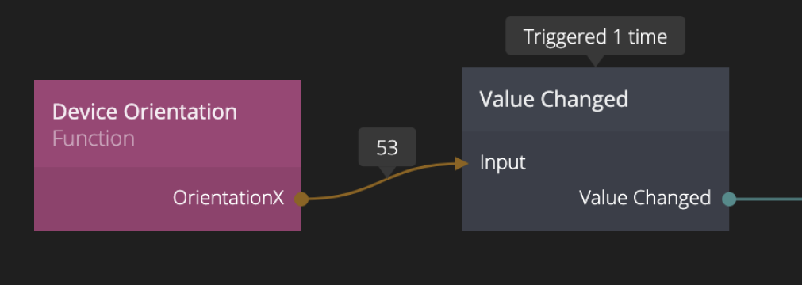

<##head##>

# Value Changed

This node sends a signal when the input value changes.

The Value Changed node is useful to trigger actions in your web app based on changes in your data.

<##head##>

## Inputs

**Input**
The value that this node should observe.

## Outputs

**Value Changed**
This signal is sent when the input value is changed.

