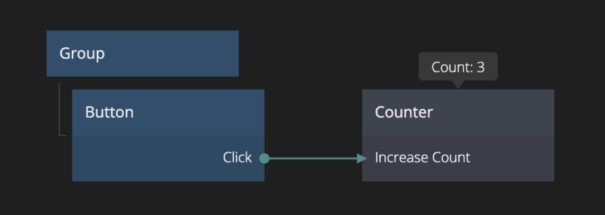
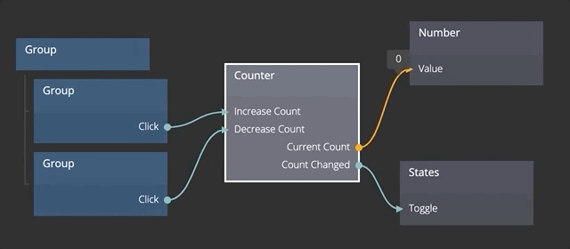

<##head##>

# Counter

This node holds a number that can be increased or decreased with signals.

The Counter node can be limited to a `min` and a `max` value, and the limit can be turned on and off.

<##head##>

## Inputs

**Increase Count**
<##input:increase##>Triggering this action will increases the count by one.<##input##>

**Decrease Count**
<##input:decrease##>Triggering this action will decrease the count by one.<##input##>

**Reset To Start**
<##input:reset##>Triggering this action will reset the counter to its _Start Value_.<##input##>

**Start Value**
<##input:startValue##>The start value of the count. Defaults to zero.<##input##>

### Limits

**Min Value**
<##input:limitsMin##>The minimum value of the counter. The counter will never decrease below this value. Note that **Limits Enabled** need to be set to `true` for this to be in effect.<##input##>

**Max Value**
<##input:limitsMax##>The maximum value of the counter. The counter will never increase above this value. Note that **Limits Enabled** need to be set to `true` for this to be in effect.<##input##>

**Limits Enabled**
<##input:limitsEnabled##>This input controls if the limits (**Min Value** and **Max Value**) are active or disabled.<##input##>

## Outputs

**Current Count**
<##output:currentCount##>This output contains the current count.<##output##>

**Count Changed**
<##output:countChanged##>This signal will be triggered whenever the **Current Count** changes.<##output##>

