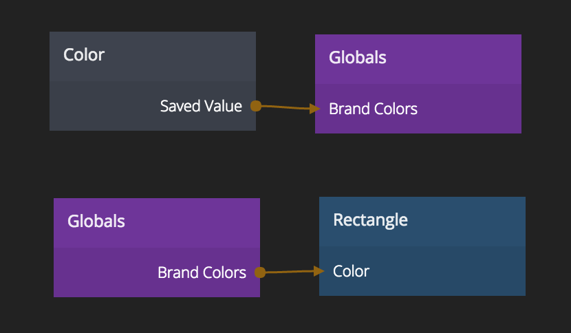

# Globals

A node used to communicate values across the project.

## Inputs and Outputs
An combined input and output is created by adding ports in the inspect view (left click on the node).

If there are multiple Global nodes with ports of the same name they will have the same value.

**Example**  
A *Globals* node with a port named *Brand Color* is created in one component.
A *Color* node is connected the *Brand Color* and set to a nice color.

A new *Globals* is created in another component. A port is added with the same name, *Brand Color*.
This is used to set the color of a few visual nodes.

Now if the *Brand Color* is changed in the first *Globals* node the color will also be changed on all
other *Globals* node that have the same port.

