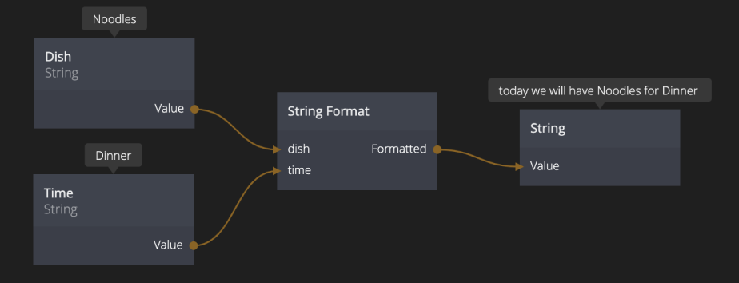
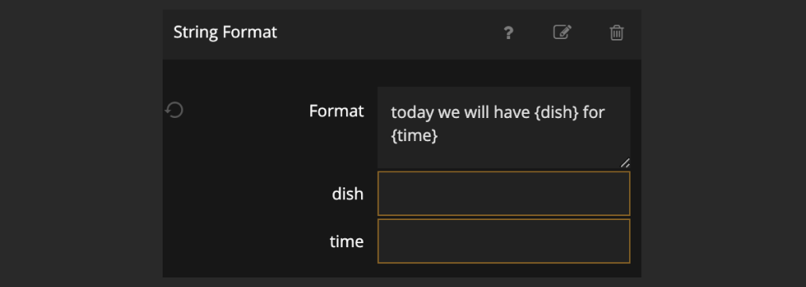

<##head##>

# String Format

This node is used to construct a new text string from multiple other text strings.

The String Format node needs a format input where the output string and string variables are defined.

<##head##>

## Inputs

| Data                                           | Description                                                                                                                                                                                                                                                                                  |
| ---------------------------------------------- | -------------------------------------------------------------------------------------------------------------------------------------------------------------------------------------------------------------------------------------------------------------------------------------------- |
| Format           | This input contains the format string, that is the template that will be used to generated the output. Any part of the template that is encapsulated in bracets will generate an input port. E.g. setting the string format to _{Hours} hours ago_ will create an input port called _Hours_. |
| Your `{strings}` | The input ports generated from the **Format** input.                                                                                                                                                                                                                                         |

## Outputs

| Data                                    | Description                                                                                                                     |
| --------------------------------------- | ------------------------------------------------------------------------------------------------------------------------------- |
| Formatted | The formatted string, e.g. if the string format is _{Hours} hours ago_ and the _Hours_ input is connected to a value of _9_ the |
| formatted string will be _9 hours ago_. |
