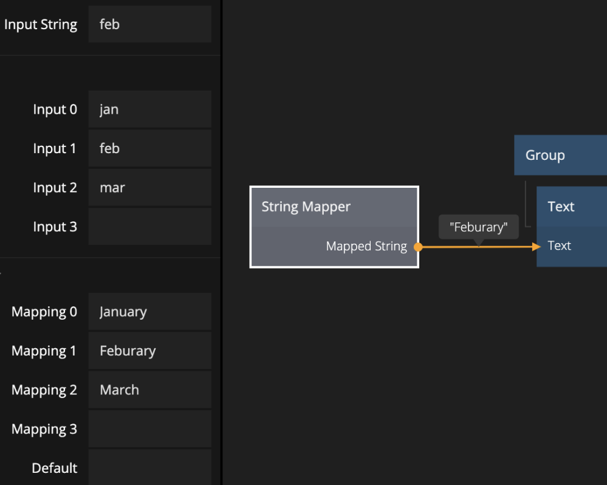

<##head##>
# String Mapper

This node receives an input string, looks it up in a mapping table, and outputs the correct output string.
You define your own string mappings. You can also define a default value to output if the String Mapper node receives an unspecified input string.

<##head##>

## Inputs

**Input 0..N**
The input strings, any string that matches one of these values will be mapped.

**Mapping 0..N**
The mapped strings, for each of the input strings there can be a corresponding mapped string.

**Input String**
The string that will be used to look up mapping, e.g. if the string matches _Input 2_ then the _Mapped String_ output
will be the value of _Mapping 2_.

## Outputs

**Mapped String**
The mapped string that corresponds to the value of _Input String_, e.g. if the _Input String_ value matches _Input 2_ then this output
will be the value of _Mapping 2_.

