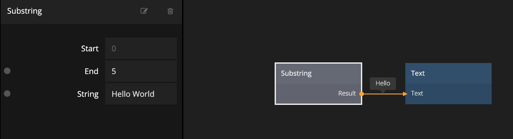

<##head##>

# Substring

This node lets you extract a part of a string given a start and end character position.

<##head##>

## Inputs

**String**
The source string where the substring should be extracted from.

**Start**
The character index of the start of the substring.

**End**
The character index of the end of the substring.

## Outputs

**Result**
The extracted substring.

