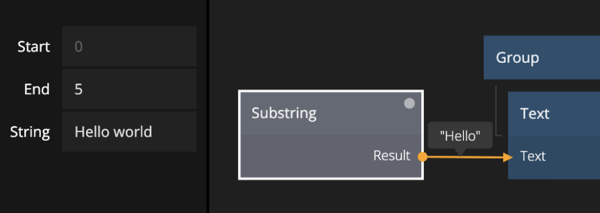

<##head##>

# Substring

This node lets you extract a part of a string given a start and end character position.

<##head##>

## Inputs

| Data                                 | Description                                                     |
| ------------------------------------ | --------------------------------------------------------------- |
| String | The source string where the substring should be extracted from. |
| Start  | The character index of the start of the substring.              |
| End    | The character index of the end of the substring.                |

## Outputs

| Data                                 | Description              |
| ------------------------------------ | ------------------------ |
| Result | The extracted substring. |
