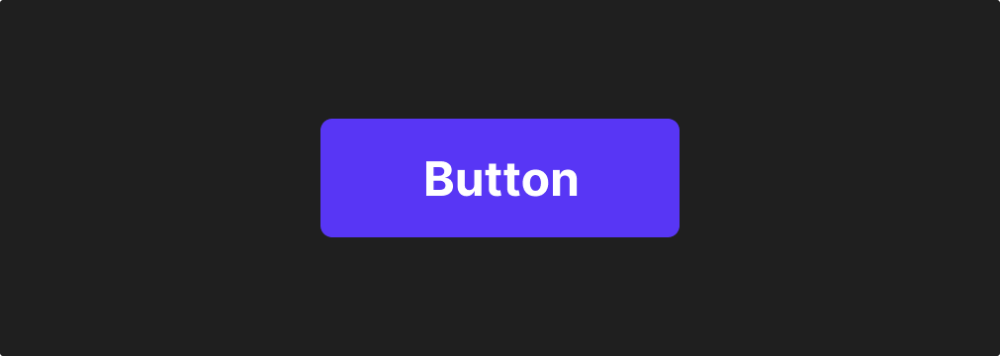

<##head##>

# Button

This node places a customizable button in the visual tree.

The button has a Click signal that you can use to trigger actions.

<##head##>

This control contains all logic such as accessibility etc. It can be styled in via it's properties.
Use variations to create different types of buttons

## Inputs

The Button can be enabled and disabled using the Enabled input:

[filename](../shared-props/inputs/general/enabled.md ':include')

The Button node has a set of label properties that can be set:

| Data                                       | Description                                                                                      |
| ------------------------------------------ | ------------------------------------------------------------------------------------------------ |
| Enable Label | Sets whether the label is visible or not.                                                        |
| Text Style   | Set an existing text style to this node, or create a new text style from the current properties. |
| Label        | A text string that will be shown as the label on the button.                                     |

Similarly, it has a set of icon properties:

| Data                                      | Description                                                                                         |
| ----------------------------------------- | --------------------------------------------------------------------------------------------------- |
| Enable Icon | Sets whether the icon is visible or not.                                                            |
| Type        | Use this to set if you want to use a predefined `icon` or a custom `image` from the project folder. |
| Source      | Where to get the icon.                                                                              |
| Spacing     | The spacing between the text and the icon.                                                          |
| Placement   | Sets whether the icon should be to the `left` or to the `right` of the _Label_                      |
| Size        | The width of the icon in `px`.                                                                      |
| Color       | Sets the color of the icon. Only visible if _Type_ is set to `icon`.                                |

### Visual

This node supports the following [Visual Input Properties](nodes/ui-elements/visual-input-properties/):

-   [Margin](nodes/ui-elements/visual-input-properties/#margin)
-   [Padding](nodes/ui-elements/visual-input-properties/#padding)
-   [Alignment](nodes/ui-elements/visual-input-properties/#alignment)
-   [Dimensions](nodes/ui-elements/visual-input-properties/#dimensions)
-   [Layout, Position](nodes/ui-elements/visual-input-properties/#-position)
-   [Text Styles](nodes/ui-elements/visual-input-properties/#text-styles)
-   [Style](nodes/ui-elements/visual-input-properties/#style)
-   [Border Style](nodes/ui-elements/visual-input-properties/#border-style)
-   [Corner Radius](nodes/ui-elements/visual-input-properties/#corner-radius)
-   [Box Shadow](nodes/ui-elements/visual-input-properties/#box-shadow)
-   [Placement](nodes/ui-elements/visual-input-properties/#placement)
-   [Dimension Constraints](nodes/ui-elements/visual-input-properties/#dimension-constraints)
-   [Other](nodes/ui-elements/visual-input-properties/#other)
-   [Advanced Style](nodes/ui-elements/visual-input-properties/#advanced-style)

## Outputs

The main output for the button is the Click signal:

| Signal                                | Description                                                                                 |
| ------------------------------------- | ------------------------------------------------------------------------------------------- |
| Click | <##output:onClick##>A signal is sent on this output when the button is clicked.<##output##> |

It also features a set of more in depth signals:

[filename](../shared-props/outputs/control-events/README.md ':include')

### States

Apart from triggering signals the Button node also notifies of its state through data outputs:

[filename](../shared-props/outputs/control-states/README.md ':include')

### Visual

This node supports the following [Visual Output Properties](nodes/ui-elements/visual-output-properties/):

-   [Bounding Box](nodes/ui-elements/visual-output-properties/#bounding-box)
-   [Mounted](nodes/ui-elements/visual-output-properties/#mounted)
-   [Other](nodes/ui-elements/visual-output-properties/#other)

[filename](../visual-input-properties/README.md ':include')
[filename](../visual-output-properties/README.md ':include')

