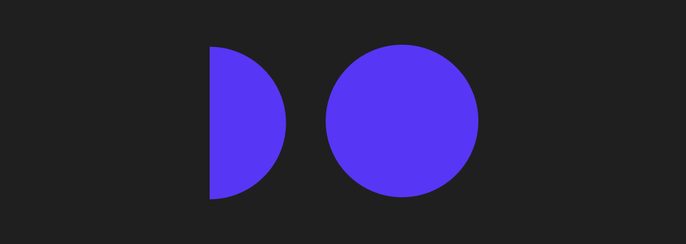

<##head##>

# Cirle

This node places a circle (or a circle segment) in the visual tree. It features a wide range of design options.

<##head##>

## Inputs

| Data                                       | Description                                                                                                                                                                        |
| ------------------------------------------ | ---------------------------------------------------------------------------------------------------------------------------------------------------------------------------------- |
| Size         | Specifies the size of the Circle in pixels.                                                                                                                                        |
| Start Angle  | The start angle of the Circle segment.                                                                                                                                             |
| End Angle    | The end angle of the Circle segment.                                                                                                                                               |
| Fill         | Specify whether the Cirlce should be filled or not.                                                                                                                                |
| Fill Color   | Specify the fill color.                                                                                                                                                            |
| Stroke       | Enables the stroke of the Circle.                                                                                                                                                  |
| Stroke Width | Sets the width of the Circle stroke.                                                                                                                                               |
| Stroke Color | Sets the stroke color of the Circle stroke.                                                                                                                                        |
| Line Cap     | Specifies what kind of cap there will be on the circle stroke.  `Butt`: A direct cut, not rounded end of the circle stroke. `Round`: A round end to the circle stroke. |

### Visual

This node supports the following [Visual Input Properties](nodes/ui-elements/visual-input-properties/):

-   [Margin](nodes/ui-elements/visual-input-properties/#margin)
-   [Alignment](nodes/ui-elements/visual-input-properties/#alignment)
-   [Layout, Position](nodes/ui-elements/visual-input-properties/#-position)
-   [Placement](nodes/ui-elements/visual-input-properties/#placement)
-   [Other](nodes/ui-elements/visual-input-properties/#other)
-   [Advanced Style](nodes/ui-elements/visual-input-properties/#advanced-style)

## Outputs

Many of the UI nodes share the same outputs. Please refer to the [Visual Output Properties](nodes/ui-elements/visual-output-properties/) documentation.

This node supports the following properties:

-   [Bounding Box](nodes/ui-elements/visual-output-properties/#bounding-box)
-   [Mounted](nodes/ui-elements/visual-output-properties/#mounted)
-   [Pointer Events](nodes/ui-elements/visual-output-properties/#pointer-events)
-   [Hover Events](nodes/ui-elements/visual-output-properties/#hover-events)
-   [Other](nodes/ui-elements/visual-output-properties/#other)

[filename](../visual-input-properties/README.md ':include')
[filename](../visual-output-properties/README.md ':include')

