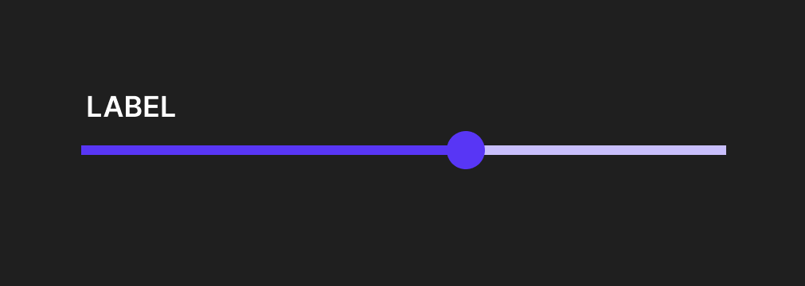
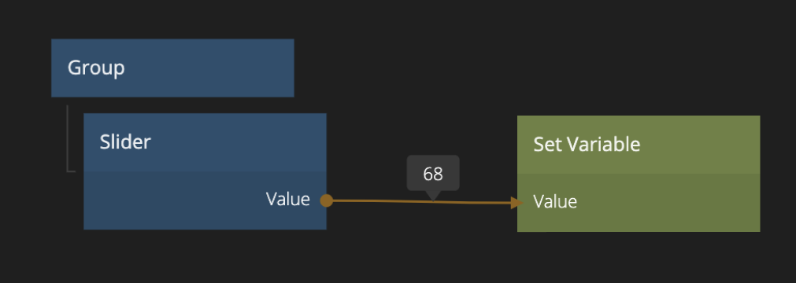

<##head##>

# Slider

This node places a range slider in the visual tree. It is used to select a number between a `min` and a `max` value.

The Slider node allows you to set a Step value. This controls in what intervals the slider can be incremented or decremented.

<##head##>

## Inputs

| Data                                | Description                                                                                                           |
| ----------------------------------- | --------------------------------------------------------------------------------------------------------------------- |
| Value | Sets the numeric value of the control.                                                                                |
| Min   | Sets the numeric minumum value that can be selected using this range control. Default is 0.                           |
| Max   | Sets the numeric maximum value that can be selected using this range control. Default is 100.                         |
| Step  | Sets the numeric step value for this range control. Values can only be selected in the specified steps. Default is 1. |

It can be enabled and disabled using the Enabled input:

[filename](../shared-props/inputs/general/enabled.md ':include')

### Thumb and track

The Property Panel features editing popouts for the Slider Thumb and Track. These are styled separately using modified versions of the [Dimensions](nodes/ui-elements/visual-input-properties/#dimensions), [Border Style](nodes/ui-elements/visual-input-properties/#border-style), [Corner Radius](nodes/ui-elements/visual-input-properties/#corner-radius) and [Box Shadow](nodes/ui-elements/visual-input-properties/#box-shadow) gadgets.

### Visual

This node supports the following [Visual Input Properties](nodes/ui-elements/visual-input-properties/):

-   [Margin](nodes/ui-elements/visual-input-properties/#margin)
-   [Padding](nodes/ui-elements/visual-input-properties/#padding)
-   [Alignment](nodes/ui-elements/visual-input-properties/#alignment)
-   [Dimensions](nodes/ui-elements/visual-input-properties/#dimensions)
-   [Layout, Position](nodes/ui-elements/visual-input-properties/#-position)
-   [Style](nodes/ui-elements/visual-input-properties/#style)
-   [Placement](nodes/ui-elements/visual-input-properties/#placement)
-   [Other](nodes/ui-elements/visual-input-properties/#other)
-   [Advanced Style](nodes/ui-elements/visual-input-properties/#advanced-style)

## Outputs

| Data                                        | Description                                                                                                                             |
| ------------------------------------------- | --------------------------------------------------------------------------------------------------------------------------------------- |
| Value         | The current selected numeric value of the range control.                                                                                |
| Value Percent | The current selected numeric value of the range control adjusted to be between `0` and `100`, so the value of the range control in `%`. |

[filename](../shared-props/outputs/control-events/README.md ':include')

### States

The Slider

[filename](../shared-props/outputs/control-states/README.md ':include')

### Visual

This node supports the following [Visual Output Properties](nodes/ui-elements/visual-output-properties/):

-   [Bounding Box](nodes/ui-elements/visual-output-properties/#bounding-box)
-   [Mounted](nodes/ui-elements/visual-output-properties/#mounted)
-   [Other](nodes/ui-elements/visual-output-properties/#other)

[filename](../visual-input-properties/README.md ':include')
[filename](../visual-output-properties/README.md ':include')

