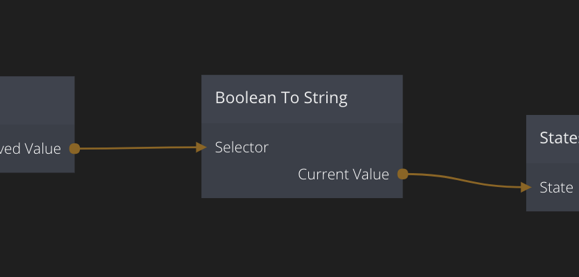

<##head##>

# Boolean To String

This node takes a boolean input and converts it into the strings true or false.

<##head##>

## Inputs

| Data                                           | Description                                                                                       |
| ---------------------------------------------- | ------------------------------------------------------------------------------------------------- |
| Selector         | <##input:selector##>This is the boolean value that will select which string to output.<##input##> |
| String for true  | <##input:trueString##>The string to output if the selector is true.<##input##>                    |
| String for false | <##input:falseString##>The string to output if the selecor is false.<##input##>                   |

## Outputs

| Data                                        | Description                                                                                                                                      |
| ------------------------------------------- | ------------------------------------------------------------------------------------------------------------------------------------------------ |
| Current Value | <##output:currentValue##>The selected string, i.e. either **String for true** or **String for false** depending on the **Selector**.<##output##> |

| Signal                                           | Description                                                                                   |
| ------------------------------------------------ | --------------------------------------------------------------------------------------------- |
| Selector Changed | <##output:inputChanged##>This signal is sent when the **Selector** changes value.<##output##> |
