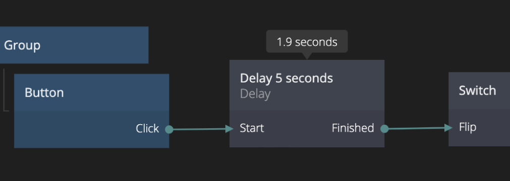

<##head##>

# Delay

This node lets you delay signals by the specified amount of milliseconds.

<##head##>

## Inputs

| Signal                                  | Description                                                           |
| --------------------------------------- | --------------------------------------------------------------------- |
| Start   | Starts the timer. Does nothing if the timer is already running.       |
| Restart | Starts the timer. Restarts the timer if the timer is already running. |
| Stop    | Stops the timer if it's running. Does nothing otherwise.              |

| Data                                      | Description                                                                                        |
| ----------------------------------------- | -------------------------------------------------------------------------------------------------- |
| Duration    | The duration of the timer in milliseconds.                                                         |
| Start Delay | The delay before the timer starts after the _Start_ input is triggered. Specified in milliseconds. |

## Outputs

| Signal                                   | Description                                |
| ---------------------------------------- | ------------------------------------------ |
| Started  | Signal emitted when the timer starts.      |
| Finished | Signal emitted when the timer is finished. |
