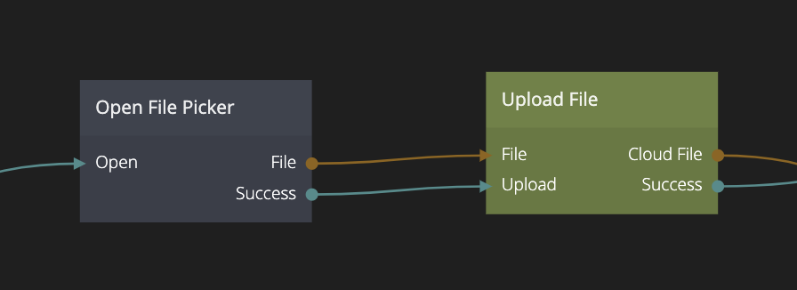

<##head##>

# Open File Picker

This node opens a file picker dialog. Noodl uses the system file picker dialog, meaning it works seamlessly with the users native device experience.

You can define what file types are allowed to be uploaded. This is done by entering a string of file types: each item needs to start with a period (`.`) and be separated by a comma (`,`). Leave the list blank if you want to accept any file type.

<##head##>

## Inputs

| Signal                               | Description                                                                     |
| ------------------------------------ | ------------------------------------------------------------------------------- |
| Open | <##input:open##>Send a signal to this input to open the file picker.<##input##> |

| Data                                              | Description                                                                                                                                                                                                                                                                                                                                                                                                                                                                  |
| ------------------------------------------------- | ---------------------------------------------------------------------------------------------------------------------------------------------------------------------------------------------------------------------------------------------------------------------------------------------------------------------------------------------------------------------------------------------------------------------------------------------------------------------------- |
| Accepted file types | <##input:accepted file types##>A comma separated list of file types that the user can select. Leave blank to accept any file type.<##input##>  The file type can be specified as a filename extension, starting with a period. E.g. `.png`, `.json` or `.png, .jpg`.  The type can also be specified as a [MIME type](https://developer.mozilla.org/en-US/docs/Web/HTTP/Basics_of_HTTP/MIME_types/Common_types). E.g. `image/*`, `image/png` or `video/mp4`. |

## Outputs

| Data                               | Description                                                                                                                                                                                                                                                                                                                                                                     |
| ---------------------------------- | ------------------------------------------------------------------------------------------------------------------------------------------------------------------------------------------------------------------------------------------------------------------------------------------------------------------------------------------------------------------------------- |
| File | <##output:file##>A web file API Object.<##output##> A [File](https://developer.mozilla.org/en-US/docs/Web/API/File) object. This can be used uploaded via [Upload File](/nodes/cloud-services/upload-file.md), sent as a part of a [REST](/nodes/data/rest.md) call, processed in a [Function](/nodes/javascript/function.md) node, used together with modules, or other tasks. |

### Metadata

| Data                                        | Description                                                            |
| ------------------------------------------- | ---------------------------------------------------------------------- |
| Path          | <##output:path##>The local path to the file.<##output##>               |
| Name          | <##output:name##>Name of the file, without the path.<##output##>       |
| Size in bytes | <##output:size in bytes##>Total size of the file in bytes.<##output##> |
| Type          | <##output:type##>The file type<##output##>                             |

| Signal                                  | Description                                                                 |
| --------------------------------------- | --------------------------------------------------------------------------- |
| Success | <##output:success##>Triggered when the user has selected a file<##output##> |
